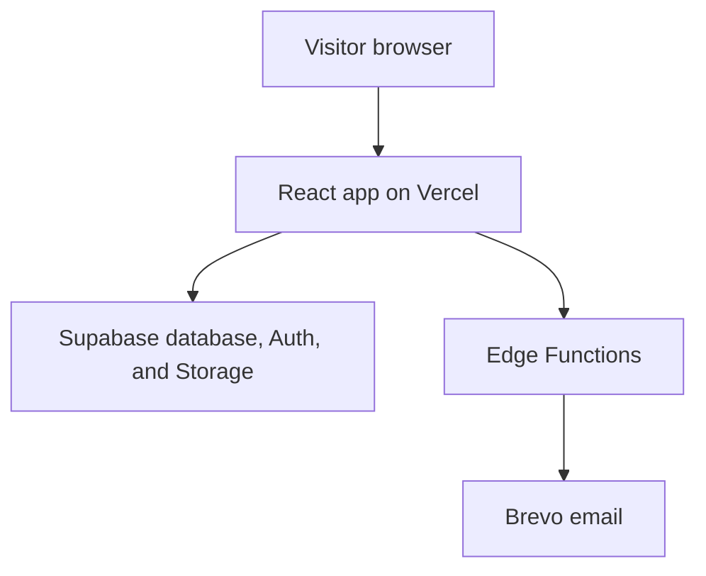

# Chapter 01 - Introduction

You're building a real, deployed **full-stack software engineer portfolio**. Not a static page. Not a template with your name dropped into it. A small production-shaped system where the public site shows your work, the owner manages content from an admin dashboard, visitors can contact you, and the backend protects what should not be public.

The stack is deliberately modern but not magical: **Vite + React + TailwindCSS + shadcn/ui** for the frontend, **Supabase** for Postgres, Auth, Row Level Security, Storage, Edge Functions, Realtime, and Cron, **Brevo** for email notifications, and **Vercel** for deployment.

The finished app answers a human question first: *Can someone trust this engineer enough to start a conversation?* Then it answers the engineering questions hiding underneath: *Where does the data live? Who can change it? Where do secrets live? What happens if email fails? What does the owner see that a visitor cannot?*

## Where we're headed

By the end you will have a deployed portfolio with public pages, projects, articles, comments, contact form persistence, Brevo email notifications, newsletter subscriptions, page visit tracking, image uploads, owner login, admin CRUD, a contact inbox, RLS policies, and a production deployment.

You are not expected to understand all of those pieces yet. This list names the destination. Each chapter introduces one small part, gives you a gate, and then lets you move forward.

## Effort map

These estimates assume you know moderate HTML, CSS, and JavaScript, but are still new to React, Supabase, deployment, and production habits. Use them as planning ranges, not promises. If a chapter touches a tool you have never used, give yourself the high end of the estimate.

| Chapter | Estimated time | Prerequisites before starting |
| --- | --- | --- |
| 01 - Introduction | 30-45 min | Basic web app vocabulary: frontend, backend, database |
| 02 - Project setup | 1-2 hours | Terminal basics, npm, Git basics |
| 03 - Data model and migrations | 2-4 hours | Tables, rows, primary keys, basic SQL |
| 04 - RLS and security | 2-4 hours | Auth vs authorization, public vs private data |
| 05 - Public layout and routing | 2-3 hours | React components, basic routing idea |
| 06 - Projects from Supabase | 3-5 hours | `useState`, `useEffect`, async functions, Supabase reads |
| 07 - Articles, comments, search | 4-6 hours | Lists, filters, pagination, safe rendering idea |
| 08 - Owner auth and dashboard | 3-5 hours | Supabase Auth, protected routes, dashboard layout |
| 09 - Admin project CRUD | 4-7 hours | Forms, validation, create/update/delete, RLS rules |
| 10 - Admin article CRUD | 4-7 hours | Rich text decision, draft/publish states, comment moderation |
| 11 - Image storage | 3-5 hours | File inputs, storage paths, public vs private assets |
| 12 - Contact Edge Function and Brevo | 4-6 hours | Edge Functions, secrets, request/response flow |
| 13 - Contact inbox and Realtime | 3-5 hours | Admin reads, `useEffect` cleanup, subscriptions |
| 14 - Newsletter and Cron | 4-6 hours | Migrations, RLS, Edge Functions, server-side secrets |
| 15 - Analytics and Realtime | 4-6 hours | Inserts, grouped queries, privacy trade-offs |
| 16 - Validation, errors, empty states | 2-4 hours | Form validation, loading/error UI states |
| 17 - Responsive polish and accessibility | 3-5 hours | Responsive CSS, semantic HTML, keyboard basics |
| 18 - Deploy with Vercel and Supabase | 3-6 hours | Environment variables, build commands, production testing |
| 19 - Final review and maintenance | 2-4 hours | README writing, logs, monitoring, test checklist |
| 20 - Closing | 30-60 min | A working project and learning log |

The full project is realistically a **50-90 hour build** for a motivated learner. A fast learner may finish sooner by cutting optional features. A careful learner may take longer and understand it better. Do not measure success only by speed; measure it by whether you can explain the decisions.

## The tempting version, and why it is too small

The tempting version is a static portfolio:

```txt
React pages
Hard-coded project cards
mailto: contact link
manual updates in source code
```

That is fine for a weekend demo, but it avoids the decisions employers actually care about. It does not show how you model data, protect private records, handle failure, store images, deploy secrets, or build owner workflows.

The better version is still small, but it has real system boundaries:

```txt
Public visitor -> React pages -> Supabase public reads
Owner -> Supabase Auth -> protected admin dashboard
Contact form -> Edge Function -> contact_messages + Brevo notification
Images -> Supabase Storage
Deployment -> Vercel + Supabase secrets
```

This course is about that better version.

## New ideas before you build

### Full-stack application

**Real-life analogy:** a restaurant has a dining room and a kitchen. Visitors see the dining room, but ordering, storing ingredients, and preparing food happen in the kitchen.

**General idea:** the frontend is what visitors see in the browser. The backend stores data, protects private actions, handles secrets, and runs server-side workflows.

```txt
Frontend: React pages visitors use
Backend: Supabase database, Auth, Storage, Edge Functions
Email: Brevo notifications from server-side code
Deployment: Vercel hosts the public React app
```

Study more: [React Crash Course - Introduction to React and JSX](https://resources.devweekends.com/courses/react-crash-course/01-intro-jsx)

### Static vs dynamic content

**Real-life analogy:** a printed poster cannot update itself. A notice board can be changed whenever there is new information.

**General idea:** hard-coded portfolio content is static. Database-backed content is dynamic because the owner can add, edit, publish, and unpublish without changing source code.

```tsx
// Static
const projects = [{ title: "Portfolio" }];

// Dynamic
const projects = await getPublishedProjects();
```

Study more: [Frontend Interview Questions - React Fundamentals](https://resources.devweekends.com/resources/frontend-interview-qs)

## The people who use it

- **Visitor.** Wants to quickly understand who you are, what you can build, whether your work is credible, and how to contact you.
- **Portfolio owner.** Wants to add projects, publish articles, review messages, see basic visit signals, and update content without editing code.

## In scope

- Public portfolio pages for home, about, projects, articles, article details, contact, and not-found.
- Supabase Postgres tables for projects, articles, comments, contact messages, newsletter subscribers, page visits, newsletter runs, and profile settings.
- Supabase Auth for one owner account using email/password, OAuth, or magic link.
- Row Level Security so public users only read published content and the owner controls admin data.
- Supabase Storage for project and article images.
- Supabase Edge Functions for contact submission and newsletter/email workflows.
- Brevo transactional email from server-side functions only.
- Vercel deployment with public Vite env vars separated from private Supabase/Brevo secrets.

## Out of scope

- A public multi-user platform. This is owner-managed, not a social network.
- Payment processing.
- Complex analytics that require a third-party tracking platform.
- Giving the learner solution code to copy. The guide names what to build and why; the learner writes the implementation.

## When you get stuck

Getting stuck is part of the course, not a sign that you are behind. Use this four-line reset before asking for help or moving on:

```txt
I expected...
Actually happened...
I checked...
My smallest next test is...
```

If you cannot fill in all four lines, the next step is not more coding. The next step is to make the problem smaller.

## Definition of Done

- [ ] You can describe the finished product in one minute.
- [ ] You can name the public user and the owner user.
- [ ] You can explain why this portfolio needs a backend.
- [ ] You can explain which parts belong in Supabase, Vercel, and Brevo.
- [ ] You have created a `learning-log/` folder in the project you will build.

> **Log it.** In `learning-log/01-introduction.md`, answer: why is a database-backed portfolio stronger than a static one for a software engineer? Which part of the system are you most likely to be asked about in an interview?

## Between chapters

Optional pause. Pick **one or two**, not all of them. Skip the rest without guilt if your Definition of Done is complete.

**Blog links:** read [MDN - Overview of HTTP](https://developer.mozilla.org/en-US/docs/Web/HTTP/Guides/Overview) for client-server architecture and [MDN - A typical HTTP session](https://developer.mozilla.org/en-US/docs/Web/HTTP/Guides/Session) to see how browsers and servers talk during one page load.

**Quick quiz:** in this portfolio, which parts are the client, which parts are the server, and which parts are third-party services?

**Diagram:**



Next: the product is clear. Now create the project foundation without leaking secrets or making setup painful. -> **[Chapter 02 - Project setup with Vite, Supabase, and Git](02-project-setup-vite-supabase-git.md)**
