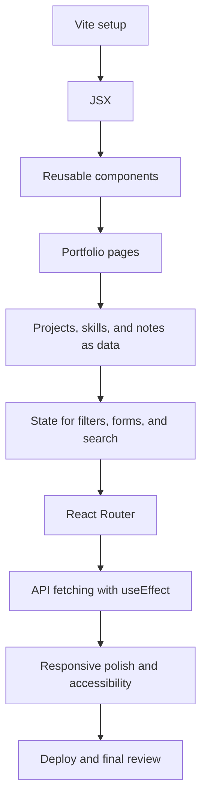

# The React Portfolio Website Project

> You're building a real, deployed **software engineer portfolio** in React — the kind of site you can send to a recruiter, mentor, client, or hiring manager without saying "it's still just a tutorial project." It introduces you clearly, shows your projects with detail, proves you understand React fundamentals, and ships on a real URL.

Your build is a portfolio for a **software engineer**, using **Vite + React**. It should feel clean, readable, and professional: strong typography, calm spacing, clear navigation, project pages that are easy to inspect, and just enough polish to show care without hiding the work. **Name the portfolio yourself** — that's your first product decision.

## Introduction — what you'll build and why it matters

A portfolio is usually the first piece of software someone uses to judge your software. That makes it an unusually honest project. If the site is messy, hard to navigate, broken on mobile, or filled with vague project descriptions, the visitor learns something before reading a single line of your resume.

The site should answer four questions within **30-60 seconds**: who are you, what can you build, why should someone trust your work, and how can they contact you. That is the product bar. Everything else in the course supports that.

This course is not about making a pretty landing page. It is about building a small React application properly: components with clear jobs, props that carry data, arrays rendered into UI, state for filters and forms, routes for pages, a dynamic project details route, API fetching with loading and error states, and a final deployment you can explain.

The tempting shortcut is to put everything in `App.jsx`, hard-code every project card, add CSS until it looks acceptable, and ship. That works for a one-hour demo. It falls apart when you add the third page, the fourth project, the second layout pattern, or a contact form. The professional approach is to give the site structure from the start: pages for screens, components for reusable UI, data files for repeatable content, and state only where the visitor can change something.

**When you're done**, you'll have a deployed portfolio with a home page, about page, skills page, projects page, project detail pages, learning notes, a GitHub/API page, contact form, responsive layout, README, and a Git history that shows the build step by step.

## How to use this course

Read this part before you create the Vite app. It explains how the course works.

### It's a sequence of chapters

The course is **12 short chapters across 1-2 weeks**. Each chapter is one focused topic: a decision to make, a React concept to learn, or a portfolio feature to build. Work through them **in order**; the full list is in the [course outline](#course-outline) below.

### Each chapter prepares you, then asks you to build

A chapter is not a copy-paste tutorial. It explains the idea, shows the weak approach and the better approach, then tells you exactly what your project must do. You write the implementation.

Most build chapters follow the same rhythm, so you are never guessing what kind of work comes next:

1. **Principle** — the simple idea behind the chapter.
2. **Where we're headed** — the feature or milestone you will have by the end.
3. **Before you build** — the required reading, daily habit, hint, and stuck reminder.
4. **Build steps** — the work broken into small checkpoints.
5. **What your screen should show** — the visible result to compare against.
6. **Small challenge** — one stretch task that makes the feature more personal.
7. **Definition of Done** — the gate before moving forward.
8. **Log it** — reflection prompts so you can explain the work later.

When you see a rule, turn it into an action. Instead of telling yourself "think carefully about architecture," ask:

```txt
Before coding:
- What problem am I solving?
- Who will use this?
- What could break later?
- Can I explain this feature in one sentence?
```

Many chapters also use this quick pattern:

```txt
✅ Do:      The behavior to practice.
❌ Don't:   The mistake to avoid.
💡 Why:     The reason this rule matters in real work.
```

Most build chapters start with **Before you build**. Treat that section as part of the work, not as decoration. It may include:

- **Mandatory reads/videos** — short resources placed where they matter. Read or watch them before moving on; they give the idea another angle.
- **Daily guideline** — one practical engineering habit to apply in that chapter.
- **Optional blog/extra read** — a useful deepener when it fits the task.
- **Hints** — nudges for tricky parts. A hint points at the thinking, not the finished code.
- **Stuck reminders** — prompts to slow down, write the question, use rubber duck debugging, or think on paper before thrashing through code.

Some readings appear inside a build step instead of at the top. That is intentional. Read about lists when you render a list, events when you handle a click, forms when you build a form, and `useEffect` when you fetch data. The goal is not to collect tabs; the goal is to read one useful thing, apply it immediately, and keep moving.

### The checklist is your gate

Every chapter ends with a **Definition of Done**: observable things you can run, click, see, or explain. Do not move forward until every box is true. If a box will not tick, that is the work for the day.

### Keep a learning log

Create a folder called **`learning-log/`** at the root of your project repository and commit it. Whenever a chapter asks you to explain something, write your answer in a file named after the chapter:

```txt
learning-log/
  01-introduction.md
  02-project-setup-with-vite-and-git.md
  03-components-and-jsx.md
```

This is not busywork. These notes prove you understand the choices you made. Write them in your own words, using your own portfolio as the example.

### How you're judged

On understanding, not only on a working demo. At the end, you should be able to explain:

- why the project uses Vite;
- how JSX differs from plain HTML;
- when a piece of UI should become a component;
- how props move data into components;
- why projects and skills are stored in arrays;
- when state is needed;
- how React Router shows different pages;
- how the GitHub/API page handles loading and failure;
- how the site is built and deployed.

## The project — what you're building

The portfolio is a small application with multiple pages:

- **Home.** Your name, role, short summary, main skills, and calls to action.
- **About.** Your story, learning journey, strengths, current focus, and goals.
- **Skills.** Skills grouped into categories: frontend, backend basics, tools, soft skills, and currently learning — with no fake percentage ratings.
- **Projects.** Three to six strong projects rendered from a data file, with filters and empty states.
- **Project details.** A deeper page for each project, reached through a route like `/projects/:id`.
- **Learning notes.** Short notes or articles, searchable or filterable by tag.
- **GitHub/API.** Public repository data fetched from an API, with loading and error states.
- **Contact.** A controlled form with validation, plus email and social links.
- **Not found.** A friendly fallback for unknown routes.

## The people who use it

- **Recruiter or hiring manager.** Needs to understand who you are, what you build, and how to contact you quickly.
- **Engineer reviewing your work.** Looks for project depth, readable UI, sensible structure, and whether the site behaves correctly.
- **Mentor or peer.** Wants to see what you learned and where to give feedback.
- **Future you.** Comes back later to add projects, update skills, improve writing, and remember why the code is structured this way.

## In scope

- Vite + React setup.
- Git repository, `.gitignore`, small commits, and a basic README.
- React components, JSX, props, list rendering, conditional rendering, state, `useEffect`, and React Router.
- A structured `src/` folder with pages, components, data, hooks, routes, styles, and assets.
- Data-driven projects, skills, and learning notes.
- Filtering and search.
- A controlled contact form with validation.
- API fetching from GitHub or another simple public/mock API.
- Loading, error, empty, and success states.
- Responsive CSS.
- Deployment to Netlify or Vercel.

## Out of scope

Deliberately not building these:

- A backend server.
- Login or authentication.
- A database.
- Admin editing.
- Real email delivery from your own server.
- Payments.
- TypeScript.
- Advanced global state libraries.
- A full automated test suite.
- Auto-playing media, excessive animation, fake skill ratings, and decorative complexity that makes the work harder to inspect.

Those are future projects. This one is about finishing the React foundation well.

**The flow in one line:** *set up the Vite app -> split UI into components -> build pages -> move repeated content into data -> add state for interaction -> add routing -> fetch API data -> validate the contact form -> polish -> deploy.*



## Before you start

This course assumes you already know basic HTML, CSS, and JavaScript, but you are new to React.

| You should be comfortable with | Why you need it |
|---|---|
| HTML elements, links, forms, and semantic sections | JSX looks like HTML, but lives inside JavaScript |
| CSS selectors, classes, flexbox/grid basics, and media queries | The portfolio must be responsive and readable |
| JavaScript functions, arrays, objects, imports, and events | React components are JavaScript functions that return UI |
| Browser dev tools and console errors | React and Vite errors are part of the build |
| Basic Git ideas | You will commit small, focused changes throughout |

Tools you need:

```bash
node --version
npm --version
git --version
```

If one of those commands is missing, install the missing tool before Chapter 2.

## Reading and video spine

Use these resources as the course points to them:

- DevWeekends React crash course, starting with JSX: https://resources.devweekends.com/courses/react-crash-course/01-intro-jsx
- DevWeekends React components and props: https://resources.devweekends.com/courses/react-crash-course/02-components-props
- DevWeekends React state, lists, forms, effects, and routing chapters as they appear in the build.
- DevWeekends React interview deep dive, for final review and viva prep: https://resources.devweekends.com/resources/interview-questions/react
- DevWeekends Git fundamentals: https://resources.devweekends.com/courses/devops-tools/git-fundamentals
- DevWeekends frontend interview guide: https://resources.devweekends.com/resources/frontend-interview-qs
- DevWeekends job prep and branding guide: https://resources.devweekends.com/resources/job-prep-branding
- Daily habits from `Daily_Software_Development_Guidelines.md`.

Do not read everything at once. Read the right thing when the project makes it useful.

## How the two weeks are organised

This is a **1-2 week course**. It starts with setup and moves up the React ladder one rung at a time.

- **Week 1 — React foundations and core portfolio pages:** setup, JSX, components, props, layout, home, about, skills, and projects from data.
- **Week 2 — Application behavior, polish, and ship:** routing, project details, search/filter state, forms, API fetching, responsive polish, accessibility, README, and deployment.

## Course outline

### Week 1 — Foundations and core pages

#### Module 1 — Decisions & setup

| # | Chapter | Done when... |
|---|---------|--------------|
| 2 | [Project setup with Vite and Git](02-project-setup-with-vite-and-git.md) | The app runs locally, starter files are cleaned, Git is initialized, and the first commit is made |
| 3 | [Components and JSX](03-components-and-jsx.md) | The app has a sensible layout, navbar, footer, button, and section title components |

#### Module 2 — The first pages

| # | Chapter | Done when... |
|---|---------|--------------|
| 4 | [The home page](04-home-page.md) | The landing page introduces you, shows key skills, and links to projects/contact |
| 5 | [About and skills](05-about-and-skills.md) | About content and grouped skills render from reusable pieces |

#### Module 3 — Projects as data

| # | Chapter | Done when... |
|---|---------|--------------|
| 6 | [Projects from data](06-projects-from-data.md) | Project cards render from `src/data/projects.js`, with categories and clean empty states |

### Week 2 — Behavior, polish, and ship

#### Module 4 — Routing and detail

| # | Chapter | Done when... |
|---|---------|--------------|
| 7 | [Routing and project details](07-routing-and-project-details.md) | React Router handles pages, `/projects/:id` works, and unknown routes show a fallback |

#### Module 5 — Interaction

| # | Chapter | Done when... |
|---|---------|--------------|
| 8 | [Learning notes search](08-learning-notes-search.md) | Notes render from data and can be searched or filtered by tag |
| 9 | [The contact form](09-contact-form.md) | Controlled inputs, validation errors, disabled submit, and success state work |
| 10 | [The GitHub/API page](10-github-api-page.md) | Repositories or mock API data load with loading, error, empty, and success states |

#### Module 6 — Finish like an engineer

| # | Chapter | Done when... |
|---|---------|--------------|
| 11 | [Responsive polish and accessibility](11-responsive-polish-and-accessibility.md) | Mobile navigation, spacing, contrast, keyboard flow, and content polish are checked |
| 12 | [Deploy and final review](12-deploy-and-final-review.md) | The production build is deployed, README is complete, and you can defend the project |

## Your working rhythm

Set these habits from Day 1:

### Commits

✅ Do: Commit small changes with messages like `feat: add project card`.

❌ Don't: Commit 50 files at once with a message like `update` or `final`.

💡 Why: Small commits are easier to review, explain, revert, and debug.

### Git safety

✅ Do: Keep generated and private files out of Git.

❌ Don't: Commit `node_modules/`, `dist/`, `.env`, logs, passwords, or API keys.

💡 Why: You do not want to upload secrets, huge build files, personal settings, or files that can be regenerated.

### Debugging

✅ Do: Read the error before changing code. Write what you expected, what happened, and the exact error.

❌ Don't: Change random files until the error disappears.

💡 Why: Guessing sometimes hides the real bug and creates a second one.

### Edge cases

✅ Do: Test empty filters, invalid forms, missing project IDs, failed API requests, and mobile screens.

❌ Don't: Test only the happy path where everything works.

💡 Why: Real users arrive with broken links, small screens, slow networks, and unfinished form input.

### Maintainability

✅ Do: Split a file when it becomes difficult to understand.

❌ Don't: keep adding logic to one component because "it still works."

💡 Why: If a file needs a lot of comments to explain itself, it may be doing too many jobs.

### Learning log

✅ Do: Write short notes in your own words after each chapter.

❌ Don't: paste definitions you cannot explain.

💡 Why: Your notes become interview practice and proof that you understand your own project.

## Your developer progression

This portfolio starts at Level 1, but the habits scale upward:

| Level | Where you are | What good looks like |
|---|---|---|
| 1 | Personal projects | You can build, explain, commit, and deploy your own work |
| 2 | Team projects | You can make readable changes someone else can review |
| 3 | Open source | You can follow project conventions and explain trade-offs in public |
| 4 | Production systems | You can think about users, failure, security, maintainability, and rollback |

Do not skip levels. A clean personal project is not small; it is the first place you practice professional behavior without waiting for a job title.

Keep one small reminder at the top of your learning log: **why you started this portfolio**. Maybe you want your first software role, a cleaner way to show your projects, or proof that you can finish and ship something real. Write that reason in one honest paragraph. On difficult days, read it before opening the editor.

When you feel stuck, do not treat the feeling as proof that you are failing. Treat it as a question your mind is asking but has not yet phrased clearly. Write the question down. Take a short walk. Think on paper. Explain the bug out loud. A stuck feeling often becomes solvable once it becomes a sentence.

One useful practice is **rubber duck debugging**: explain the problem to an imaginary rubber duck, a notebook, or a friend who does not interrupt. Start from what you expected, then what happened, then the exact file and line you suspect. The point is not the duck. The point is forcing your thoughts to become precise enough that the missing step has somewhere to reveal itself.

---

Ready? Start with **[Chapter 2 — Project setup with Vite and Git ->](02-project-setup-with-vite-and-git.md)**
