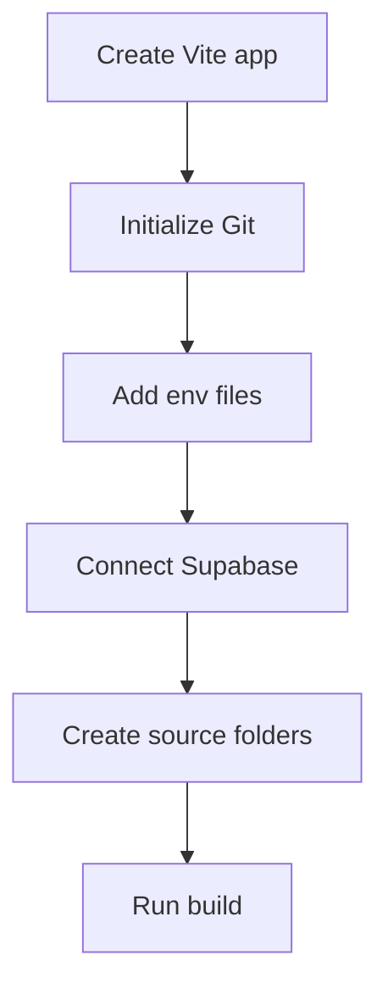

# Chapter 2 - Project setup with Vite, Supabase, and Git

You are starting a full-stack portfolio, so the first checkpoint is not only "React runs." The app needs a clean frontend, a Supabase project path, environment files, and a Git history that does not leak secrets.

> **Principle.** A clean start is the first security decision.

## Where we're headed

By the end, you have a Vite React app, a Supabase project, a local folder structure, safe environment files, a `learning-log/`, and a first commit.



## Before you build

> **Mandatory read.** Read DevWeekends Git Fundamentals: https://resources.devweekends.com/courses/devops-tools/git-fundamentals. Focus on small commits, staging, and keeping generated/private files out of Git.

> **Apply this habit.** Read "Protect Sensitive Information" in [Daily_Software_Development_Guidelines.md](../Daily_Software_Development_Guidelines.md), then write which files must never be committed.

> **When you're stuck.** Use rubber duck debugging: say what command you ran, what you expected, what happened, and which file changed last.

## Step 1 - Create the Vite app

Create the React app:

```bash
npm create vite@latest full-stack-portfolio -- --template react
cd full-stack-portfolio
npm install
npm run dev
```

Vite runs the frontend. Supabase will provide the backend services: Postgres, Auth, Storage, RLS, and Edge Functions.

Do not start from a large template. The point of this course is that you can explain every dependency.

## Step 2 - Add the first folder structure

Create this structure inside `src/`:

```txt
src/
  components/
  features/
  lib/
  pages/
  routes/
  styles/
```

Use `lib/` for shared clients such as the Supabase client. Use `features/` for grouped work such as `projects`, `articles`, `auth`, `admin`, and `contact`.

## Step 3 - Add environment files

Create:

```txt
.env.example
.env.local
```

The example file documents the names without real values:

```txt
VITE_SUPABASE_URL=
VITE_SUPABASE_ANON_KEY=
```

`VITE_` variables are visible to the browser. Only put public frontend-safe values there. The Supabase anon key is designed to be used in the browser with RLS policies. Service role keys and Brevo keys are not.

```txt
Bad:
VITE_BREVO_API_KEY=real-key

Problem:
Vite exposes VITE_* values to the frontend bundle.

Better:
Store Brevo keys as Supabase Edge Function secrets.
```

## Step 4 - Protect the repository

Add or confirm `.gitignore` includes:

```gitignore
node_modules/
dist/
.env
.env.local
*.log
```

Real developer mistake:

```txt
Mistake:
Push `.env.local` with a service role key.

Why it's bad:
The service role bypasses RLS. Anyone with it can access protected data.

Fix:
Remove the key, rotate it, keep it server-side only, and check Git history.
```

## Step 5 - Create the learning log

Create:

```txt
learning-log/
  02-project-setup-vite-supabase-git.md
```

This folder is part of the course. It proves you can explain decisions, not just follow steps.

## Step 6 - Run the first checks

Run:

```bash
npm run build
git status
```

The build should pass before you add Supabase-specific code.

## What your screen should show

The browser shows a simple Vite React app. The repo has safe env examples and no real secrets committed.

## Small challenge

Write one sentence in the placeholder UI that says this will become a full-stack portfolio powered by Supabase.

Suggested commit:

```bash
git add -A
git commit -m "chore: set up full-stack portfolio"
```

## Definition of Done

- [ ] Vite React app runs locally.
- [ ] `npm run build` passes.
- [ ] `src/` has the planned folders.
- [ ] `.env.example` documents frontend-safe variables.
- [ ] `.env.local` is ignored.
- [ ] `.gitignore` excludes generated and secret files.
- [ ] `learning-log/02-project-setup-vite-supabase-git.md` exists.
- [ ] First commit is made.
- [ ] You can explain why Brevo and service role keys must not use `VITE_`.

> **Log it.** In `learning-log/02-project-setup-vite-supabase-git.md`: What does Vite do? What does Supabase provide? Which variables are safe for the frontend, and which are not?

Next: connect the project to Supabase safely. -> **[Chapter 3 - Supabase project and environment](03-supabase-project-and-environment.md)**
