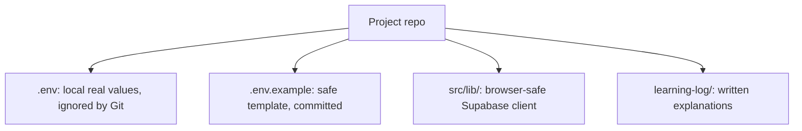

# Chapter 02 - Project setup with Vite, Supabase, and Git

Last chapter you chose the product: a full-stack portfolio, not a static resume page. Now make the repo real. Setup is not glamorous, but it is where production habits start. A messy setup leaks secrets, hides required commands, and makes every later chapter feel harder than it is.

## Where we're headed

By the end, a Vite React app runs locally, TailwindCSS and shadcn/ui are installed, Supabase client configuration is separated from secrets, `.env` is ignored, `.env.example` is committed, and Git has a clean baseline commit.

## The setup trap

The weak setup puts everything wherever it first fits:

```txt
API keys pasted into components
no .env.example
no folder plan
uncommitted setup changes for days
```

Problem: you cannot tell which values are safe for the browser, a teammate cannot reproduce your setup, and one accidental push can expose private credentials.

The professional setup separates public configuration from private secrets:

```txt
VITE_SUPABASE_URL=public project URL
VITE_SUPABASE_ANON_KEY=public anon key protected by RLS

BREVO_API_KEY=server-only, never in Vite
SUPABASE_SERVICE_ROLE_KEY=server-only, never in Vite
```

Supabase's anon key is allowed in the browser because RLS is the real guard. Brevo and service-role keys are not browser-safe and must live only in Supabase Edge Function secrets.

## New ideas before you build

### Vite and React

**Real-life analogy:** before a carpenter builds a table, they need a workshop with tools, lights, and a workbench. Vite is the workshop for your React app: it starts the local server, refreshes the browser when files change, and prepares the final build.

**General idea:** React builds the user interface from components. Vite runs and bundles that React code.

```txt
npm create vite@latest
npm run dev
npm run build
```

Study more: [React Crash Course - Introduction to React and JSX](https://resources.devweekends.com/courses/react-crash-course/01-intro-jsx)

### Environment variables

**Real-life analogy:** a hotel guest key opens one room, but a master key opens every room. Public Vite values are guest keys. Brevo and service-role keys are master keys.

**General idea:** values that start with `VITE_` are available in browser code. Never put private server secrets in them.

```txt
VITE_SUPABASE_URL=browser_safe
VITE_SUPABASE_ANON_KEY=browser_safe_only_with_RLS
BREVO_API_KEY=server_only
```

Study more: [Frontend Interview Questions - Deployment and Best Practices](https://resources.devweekends.com/resources/frontend-interview-qs)

**Pause and practice:** which of these may appear in browser code: `VITE_SUPABASE_URL`, `BREVO_API_KEY`, `SUPABASE_SERVICE_ROLE_KEY`, `VITE_SUPABASE_ANON_KEY`? For each answer, write one sentence explaining why.

**Comparison:** `.env` vs `.env.example`: `.env` contains real local values and stays out of Git. `.env.example` contains only variable names and safe placeholder values so another developer knows what to create.

### Git commits

**Real-life analogy:** saving a game before a hard level gives you a safe return point. A Git commit is a return point for your code.

**General idea:** make a clean baseline commit after setup works, so later changes can be reviewed and recovered.

```txt
git status
git add .
git commit -m "Set up portfolio app"
```

Study more: [Git Crash Course](https://resources.devweekends.com/courses/devops-tools/git-overview)

**Big word alert:** **baseline** means the first known-good version of the project. When someone says "make a baseline commit," they mean commit the clean starting point before feature work begins.

**Git exercise:** make three tiny commits instead of one large commit: project scaffold, environment/example files, and styling/tooling setup. Run `git log --oneline` and check that each message explains one clear change.

## Daily guideline

From `Daily_Software_Development_Guidelines.md`: **commit frequently** and **use `.gitignore` correctly**. Before leaving setup, make one clean baseline commit and confirm `.env`, `node_modules/`, build output, logs, and local clutter are ignored. A beginner mistake is thinking "private repo" means secrets are safe; treat every commit as something another person may eventually read.

## Build it

Create the Vite app and install the frontend tools. Use React, TailwindCSS, and shadcn/ui because this course needs a polished public site and repeatable admin UI patterns.

Create a clean source layout:

```txt
src/
  components/
  features/
  lib/
  pages/
  routes/
  styles/
```

Add a Supabase client helper in `src/lib/`. It should read only Vite-safe variables. Do not put service-role keys, Brevo keys, or database passwords in frontend code.

Create:

```txt
.env
.env.example
.gitignore
learning-log/
```

`.env.example` should show the names of required variables without real values. `.gitignore` must ignore `.env`, build output, dependency folders, editor clutter, and local Supabase artifacts that should not be committed.

**Mini assignment:** intentionally add `.env` to your working tree, confirm Git notices it, then fix `.gitignore` so Git ignores it again. Do not commit the secret file.

Commit the baseline once the app starts and builds. Small commits matter because this course will change database schema, policies, Edge Functions, and frontend code. You want rollback points.

Diagram:



## Do and don't

Do commit the first working baseline before adding features.

Don't store Brevo, service-role, or database credentials in any `VITE_` variable.

Do add a clear `.env.example`.

Don't assume a secret is safe because the repo is private.

## Mandatory read

Read the official Vite environment variables guide and Supabase's note on anon keys and RLS. Required: the rest of the course assumes you understand why some browser variables are acceptable and some secrets must stay server-side.

**Related reading:** read [MDN - HTTP](https://developer.mozilla.org/en-US/docs/HTTP) for the big picture of web requests, then skim [MDN - Webpage metadata](https://developer.mozilla.org/en-US/docs/Learn_web_development/Core/Structuring_content/Webpage_metadata) so `index.html`, `<head>`, and metadata do not feel mysterious.

## Definition of Done

- [ ] Vite React app runs locally.
- [ ] TailwindCSS and shadcn/ui are installed.
- [ ] Supabase client helper exists and uses only `VITE_` variables.
- [ ] `.env` is ignored and `.env.example` is committed.
- [ ] `learning-log/` exists.
- [ ] The baseline setup is committed.

> **Log it.** In `learning-log/02-project-setup.md`, explain the difference between a public Vite env var and a server-only secret. Name one mistake that would leak credentials.

**Motivation pause:** from `Software_Engineering_Community_Affirmations.md`: "Great software starts with small steps." Setup is one of those steps. It may feel basic, but every clean project begins here.

Next: the app runs, but it has no durable data. Build the database model that everything else depends on. -> **[Chapter 03 - Data model and migrations](03-data-model-and-migrations.md)**
