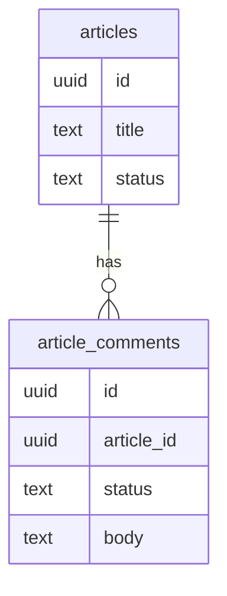

# Chapter 03 - Data model and migrations

You now have a running React app and a clean repo. The next question is where the portfolio's truth lives. Hard-coded arrays are tempting because they are fast. They are also a dead end once the owner needs admin editing, contact persistence, newsletter subscriptions, comments, or analytics.

## Where we're headed

By the end you will have a Supabase data model, versioned migrations, and seed data for the main portfolio records: `projects`, `articles`, `article_comments`, `contact_messages`, `newsletter_subscribers`, `newsletter_runs`, `page_visits`, and `profile_settings`.

## The tempting model

Bad:

```txt
projects.js
articles.js
visitor messages sent only by email
images stored as random URLs
```

Problem: the public site works, but the admin dashboard has nothing durable to edit. If an email notification fails, the contact message disappears. If an article is unpublished, no durable access rule stops public readers from seeing it.

Better:

```txt
projects(status, featured, slug, title, summary, image_path)
articles(status, slug, title, excerpt, body, category, tags)
article_comments(status, article_id, author_name, body)
contact_messages(status, name, email, subject, body)
newsletter_subscribers(status, email)
page_visits(path, referrer, country, city, created_at)
profile_settings(display_name, headline, location, links)
```

This model lets the public site read published content, the owner manage drafts, and server workflows store messages before trying external email.

Diagram:



## New ideas before you build

### Database tables

**Real-life analogy:** a spreadsheet can have separate sheets for projects, articles, messages, and subscribers. A database table is like one of those sheets, but with stronger rules.

**General idea:** each table stores one type of thing. Each row is one record. Each column is one fact about that record.

```sql
create table projects (
  id uuid primary key,
  title text not null,
  slug text unique not null,
  status text not null
);
```

Study more: [Database Engineering - Transactions and ACID](https://resources.devweekends.com/courses/database-engineering/transactions)

## Migrations are the source of truth

Creating tables by hand in the Supabase dashboard feels quick. The cost appears later: no history, no repeatable setup, and no reliable way to rebuild the database.

Use migrations. A migration is a committed schema change that can run in order. In Supabase, this usually means using the Supabase CLI and keeping SQL migration files in the repo.

Plan the dependency order:

```txt
profile_settings
projects
articles
article_comments -> articles
contact_messages
newsletter_subscribers
newsletter_runs
page_visits
```

Add useful fields from the beginning:

```txt
id uuid primary key
created_at timestamptz
updated_at timestamptz
status text
slug text unique
```

For money or historical values, snapshot the value at the time it matters. This portfolio does not sell products, but the habit matters: if a future app stores orders, do not rely only on the current product price. Save the purchased price inside the order item so old orders stay true when product prices change.

Minimum constraints to include:

```txt
required text fields use not null
status fields use check constraints, such as draft/published/archived
public slugs are unique per table
comments reference articles with a foreign key
email fields are normalized before insert
common public queries have indexes, such as status, slug, and created_at
```

For `updated_at`, choose one strategy and use it consistently: update it in application code on every edit, or add a database trigger that updates it automatically. Do not leave it stale while pretending it means "last changed."

### Migrations

**Real-life analogy:** a recipe lets another person cook the same meal in the same order. A migration lets another machine build the same database in the same order.

**General idea:** a migration is a committed database change. Use migrations instead of clicking tables into existence only in the dashboard.

```txt
supabase/migrations/
  202606080001_create_projects.sql
  202606080002_create_articles.sql
```

Study more: [Database Engineering - Case Studies](https://resources.devweekends.com/courses/database-engineering/case-studies)

### Foreign keys

**Real-life analogy:** a library loan must point to a real book. A foreign key makes sure a comment points to a real article.

**General idea:** use foreign keys when one table depends on another table.

```sql
article_id uuid references articles(id)
```

Study more: [Database Engineering - Case Studies](https://resources.devweekends.com/courses/database-engineering/case-studies)

**Comparison:** migration vs seed data: a migration changes the database structure, such as creating a table. Seed data fills that structure with sample rows for development and testing.

**Big word alert:** **normalization** means organizing data so each fact has one clear home. It reduces duplicate data and avoids bugs where one copy changes but another copy stays old.

**Related reading:** read [IBM - What is database normalization?](https://www.ibm.com/think/topics/database-normalization), then revisit the "Think About Data History" section in `Daily_Software_Development_Guidelines.md`.

**Quick quiz:** if an article changes title after comments exist, should old comments disappear, update, or stay linked to the same article id? Explain your answer.

## Daily guideline

**think about data history**. Before adding or changing a field, ask what happens when that value changes later. This portfolio does not process orders, but the habit matters: in a shop, changing a product's current price must not rewrite old order totals. Store historical facts where history matters.

**Blog prompt:** write a short post draft titled `Why changing today's data should not rewrite yesterday's truth`. Use the price-at-purchase example, then connect it back to this portfolio with drafts, published content, and saved contact messages.

## Build it

Create the migrations for the tables above. Add constraints where they protect meaning: required titles, unique slugs, allowed statuses, and foreign keys from comments to articles. Add indexes for the queries the public site will run often: published projects/articles, slug lookups, recent articles, and approved comments by article.

**Database exercise:** draw the tables before writing SQL. For each table, mark the primary key, required fields, unique fields, and foreign keys. Then compare the drawing to your migration files.

Seed one published project, one draft project, one published article, one draft article, and one sample contact message. The draft rows are important because RLS will prove public users cannot read them.

## Mandatory read

Read a database migration guide for the Supabase CLI and one short article on database normalization. Required: the next chapter adds RLS, and policies only make sense when table ownership and public/private fields are clear.

## Definition of Done

- [ ] Tables exist through committed migrations, not manual dashboard-only changes.
- [ ] Published and draft seed rows exist.
- [ ] Slugs are unique where needed.
- [ ] Comments reference articles with a foreign key.
- [ ] Status fields have allowed-value checks.
- [ ] Public read paths have useful indexes.
- [ ] You can explain why contact messages belong in the database before email is sent.
- [ ] You committed the migration files.

> **Log it.** In `learning-log/03-data-model-and-migrations.md`, explain why migrations beat hand-created tables. Then choose one field that should be a column, not hidden in a blob, and explain why.

**Motivation pause:** from `Software_Engineering_Community_Affirmations.md`: "Focus on understanding." Data modeling can feel abstract at first; understanding the shape is the win before the SQL is perfect.

Next: the data exists. Now stop the wrong people from reading or changing it. -> **[Chapter 04 - RLS and security basics](04-rls-and-security-basics.md)**
