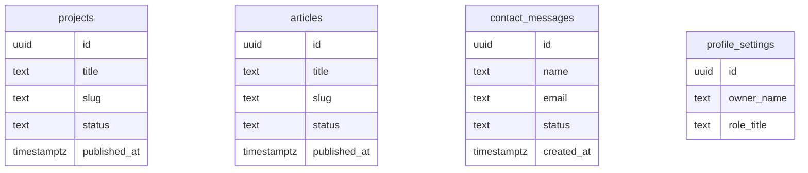

# Chapter 4 - Data model and migrations

The portfolio needs data that can change without editing React files. This chapter turns portfolio content into Postgres tables.

> **Principle.** If content changes over time, give it a real home.

## Where we're headed

By the end, the database has tables for projects, articles, contact messages, and profile settings, with IDs, timestamps, slugs, status fields, and enough structure for public pages and admin tools.



## Before you build

> **Mandatory read.** Read Supabase tables docs: https://supabase.com/docs/guides/database/tables. Focus on rows, columns, primary keys, and timestamps.

> **Apply this habit.** Read "Think About Data History" in [Daily_Software_Development_Guidelines.md](../Daily_Software_Development_Guidelines.md), then name one future change each table should support.

## Step 1 - Design `projects`

Fields should support public cards and detail pages:

```txt
id
title
slug
summary
problem
solution
contribution
challenge
result
tech_stack
repo_url
live_url
cover_image_path
status
featured
published_at
created_at
updated_at
```

Use `status` values such as `draft` and `published`. Draft projects should not appear publicly.

## Step 2 - Design `articles`

Articles make your thinking visible in a public, portfolio-ready format.

```txt
id
title
slug
excerpt
body
tags
cover_image_path
status
featured
published_at
created_at
updated_at
```

Use the public product language **Articles** throughout the app.

## Step 3 - Design `contact_messages`

Contact messages need to preserve what the visitor sent:

```txt
id
name
email
subject
message
status
source
created_at
read_at
archived_at
```

Bad:

```txt
Only send email, store nothing.
```

Problem:

```txt
If the email fails or gets lost, the message disappears.
```

Better:

```txt
Store the message first, then send a Brevo notification.
```

## Step 4 - Design `profile_settings`

Keep this small. It can hold owner display data:

```txt
owner_name
role_title
short_bio
location
email_public
github_url
linkedin_url
resume_url
```

One row is enough for this course.

## Step 5 - Create migrations

Write SQL migrations in a repeatable way. If you use the Supabase dashboard, paste the SQL into the SQL editor and save the migration text in the repo under:

```txt
supabase/
  migrations/
```

Do not edit an applied migration casually. Create a new migration for changes.

## What your screen should show

Supabase should show the four tables with useful columns and timestamps.

## Small challenge

Add one `status` field explanation to your learning log: why is `draft` versus `published` better than a simple `is_public` boolean?

Suggested commit:

```bash
git commit -m "feat: model portfolio database"
```

## Definition of Done

- [ ] `projects` table is designed.
- [ ] `articles` table is designed.
- [ ] `contact_messages` table is designed.
- [ ] `profile_settings` table is designed.
- [ ] Migrations are saved in the repo.
- [ ] Tables include timestamps.
- [ ] Content tables include `status`.
- [ ] You can explain why contact messages are stored before email is sent.

> **Log it.** In `learning-log/04-data-model-and-migrations.md`: Which tables exist, who can read them, who can write them, and what future change each one supports?

Next: protect the data. -> **[Chapter 5 - RLS and security basics](05-rls-and-security-basics.md)**
