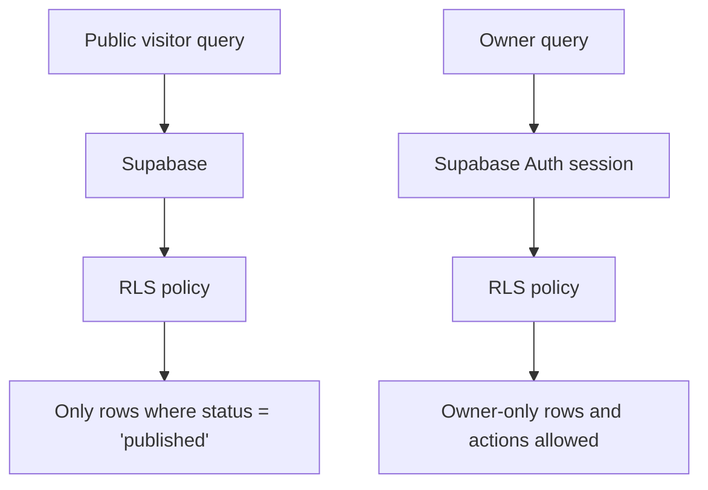

# Chapter 04 - RLS and security basics

You now have tables. That is only half the database story. The other half is deciding who can see or change each row. Supabase makes this central through **Row Level Security**, usually shortened to RLS. RLS means the database checks access rules per row, not just per API route.

## Where we're headed

By the end, public users can read only published projects and articles, only approved comments are visible publicly, only the owner can manage content, contact messages are not publicly readable, and service-role access is treated as server-only power.

## Authentication vs authorization

Authentication answers: *Who are you?*

Authorization answers: *What are you allowed to do?*

Email/password, OAuth, and magic link are login methods. They prove identity. RLS policies decide what that identity can access.

Bad:

```txt
If the React app hides the admin button, the admin data is safe.
```

Problem: UI hiding is not security. A user can call Supabase directly from the browser.

Better:

```txt
The database rejects unauthorized reads and writes even if the UI is bypassed.
```

### Authentication vs authorization

**Real-life analogy:** showing your ID proves who you are. Having a ticket proves which room you may enter.

**General idea:** authentication proves identity. Authorization decides permissions. A signed-in user still should not automatically see every row.

```txt
Authentication: "This is the owner."
Authorization: "The owner may update projects."
```

Study more: [Frontend Interview Questions - React and Security](https://resources.devweekends.com/resources/frontend-interview-qs)

### Row Level Security

**Real-life analogy:** a filing cabinet checks each folder before handing it over. Even if someone asks directly, the cabinet refuses folders they are not allowed to see.

**General idea:** RLS makes the database enforce access per row. React can hide buttons, but the database must protect the data.

```sql
create policy "Public can read published projects"
on projects
for select
using (status = 'published');
```

Study more: [Database Engineering - Case Studies](https://resources.devweekends.com/courses/database-engineering/case-studies)

## Daily guideline

From `Daily_Software_Development_Guidelines.md`: **principle of least privilege**. Give each user only the access they need. Public visitors need published projects and articles, not drafts, messages, subscribers, or admin data. The safest policy is usually the smallest policy that lets the feature work.

## The policy map

Write the policy map before writing policies:

```txt
projects
  public: read where status = 'published'
  owner: insert/update/delete

articles
  public: read where status = 'published'
  owner: insert/update/delete

article_comments
  public: read where status = 'approved'
  public: insert pending comment if allowed
  owner: moderate

contact_messages
  public: no direct reads
  insert: through Edge Function
  owner: read/update/archive

newsletter_subscribers
  public: insert through Edge Function
  owner: read/update

page_visits
  public: insert limited visit metadata
  owner: read aggregate insight
```

For this portfolio, use one safe default owner pattern: create an `owner_profile` or `app_settings` row that stores the single owner's Supabase `user_id`, lock that table down with RLS, and create a small SQL helper such as `is_owner()` that compares the stored owner id to `auth.uid()`. Use that helper in owner-only policies.

```sql
create function is_owner()
returns boolean
language sql
security definer
as $$
  select exists (
    select 1
    from owner_profile
    where user_id = auth.uid()
  );
$$;
```

Keep the owner table private. Public users should not be able to read or update the owner id, and the frontend should not decide who counts as owner.

## Build it

Enable RLS on every table. Add policies one table at a time. After each table, test the public case and the owner case before moving on. Prefer explicit policies that call `is_owner()` for owner-only insert, update, delete, and inbox reads.

Use draft seed data from Chapter 03. Try to read draft projects as a signed-out user. The correct result is no rows. Then sign in as the owner and confirm owner workflows can see or update the rows they should.

## Service-role warning

The Supabase service-role key bypasses RLS. That is useful inside Edge Functions for controlled server work. It is dangerous in the frontend. Never expose it through Vite variables, browser code, screenshots, or logs.

## Mandatory read

Read Supabase's official RLS documentation. Also read a short explanation of authentication vs authorization. Required: admin CRUD, contact inbox, and article moderation all depend on this distinction.

## Definition of Done

- [ ] RLS is enabled on every application table.
- [ ] Public users can read published projects/articles only.
- [ ] Draft content is hidden from public reads.
- [ ] Owner-only writes are blocked for signed-out users.
- [ ] Contact messages are not publicly readable.
- [ ] Owner-only policies use one consistent owner helper or owner id pattern.
- [ ] The owner id source is not publicly readable or editable.
- [ ] You can explain why service-role keys never go in frontend code.

> **Log it.** In `learning-log/04-rls-and-security.md`, write the policy map in your own words. Include one blocked case you tested.

## Learning bridge

Use this as a flexible pause point before, during, or after the chapter work. Pick **one or two**, not all of them. Skip the rest without guilt if your Definition of Done is complete.

**Blog links:** read [MDN - HTTP authentication](https://developer.mozilla.org/en-US/docs/Web/HTTP/Guides/Authentication) for the authentication flow, then read [MDN - Session management](https://developer.mozilla.org/en-US/docs/Web/Security/Authentication/Session_management) to understand why identity and session handling are separate from permission checks.

**Quick quiz:** explain the difference between "the admin button is hidden" and "the database refuses the row." Which one is user experience, and which one is security?

**Assignment:** write three blocked-case tests in plain English before implementing them: public user reading a draft project, public user reading contact messages, and signed-out user updating an article.

**Database exercise:** open the Supabase SQL editor or local SQL shell and run the same select as a public/anon user and as the owner. Record the difference in your learning log.

**Security exercise:** try to bypass the UI by querying a draft row directly from the browser console or a small script using the anon key. The correct result is no private row.

**Comparison:** authentication vs authorization: authentication proves who someone is. Authorization decides what that person may do after identity is known.

**Big word alert:** **RLS** stands for Row Level Security. It means the database checks access one row at a time, instead of assuming every query can read every row in a table.

**Diagram:**



Next: the backend is guarded. Now give visitors a public route structure they can actually navigate. -> **[Chapter 05 - Public layout and routing](05-public-layout-and-routing.md)**
