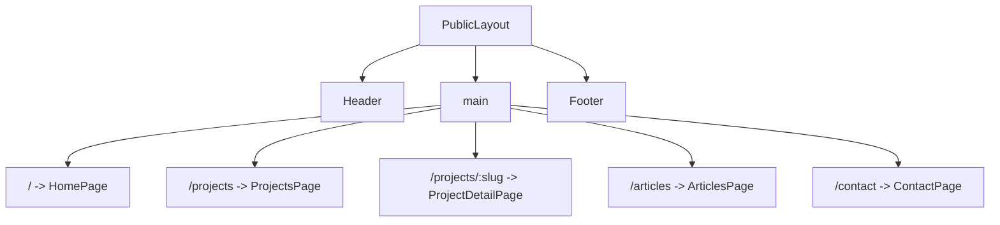

# Chapter 05 - Public layout and routing

The database is protected. Now return to the visitor. A portfolio succeeds when someone can understand it quickly without being taught the interface. Routing is the promise your app makes: each URL should mean something stable.

## Where we're headed

By the end you will have a public layout, navigation, and routes for home, about, projects, project details, articles, article details, contact, and not-found.

## The routing trap

Bad:

```txt
One giant Home component
scroll anchors for everything
project details hidden in modals
no real article URLs
```

Problem: content cannot be linked cleanly, visitors cannot share a project URL, and search/indexing signals are weak.

Better:

```txt
/                 home
/about            owner story and skills
/projects         project list
/projects/:slug   project detail
/articles         article list
/articles/:slug   article detail
/contact          contact form
```

## New ideas before you build

### Routing

**Real-life analogy:** rooms in a building have addresses. Routes give screens in your app addresses.

**General idea:** React Router connects URLs to components. A stable URL lets visitors open, bookmark, and share one exact page.

```tsx
<Route path="/projects" element={<ProjectsPage />} />
<Route path="/projects/:slug" element={<ProjectDetailPage />} />
```

Study more: [Frontend Interview Questions - React Fundamentals](https://resources.devweekends.com/resources/frontend-interview-qs)

**Mini assignment:** sketch your route tree on paper before coding. Mark which routes are public, which are admin-only, and which routes need a slug.

### Layout components

**Real-life analogy:** a book uses the same margins, header style, and page structure on every page. A layout component gives your app that shared structure.

**General idea:** put common UI like header, footer, and page wrapper in one component so every route feels consistent.

```tsx
function PublicLayout() {
  return (
    <>
      <Header />
      <main><Outlet /></main>
      <Footer />
    </>
  );
}
```

Study more: [React Crash Course - Components and Props](https://resources.devweekends.com/courses/react-crash-course/02-components-props)

**Related reading:** read [web.dev - Metadata](https://web.dev/learn/html/metadata/) and [MDN - `<head>` element](https://developer.mozilla.org/en-US/docs/Web/HTML/Reference/Elements/head). Portfolio pages are not only visual screens; their titles, descriptions, and shared-link previews matter too.

Diagram:



**Comparison:** route vs component: a route is the URL rule, like `/projects/:slug`. A component is the React function that renders what the visitor sees for that URL.

**Big word alert:** **slug** means a human-readable URL identifier, such as `react-portfolio-site`, instead of a random database id.

## Daily guideline

From `Daily_Software_Development_Guidelines.md`: **keep components focused**. A route file should decide which page appears; a layout should hold shared structure; a card should display one piece of content. If one component starts handling navigation, fetching, filtering, forms, and styling all at once, split it before it becomes hard to understand.

## Build it

Install and configure React Router. Create the public layout with header, main content, footer, and navigation. Keep the layout quiet and work-focused: a software engineer portfolio should be easy to scan, not a maze of decorative sections.

Add placeholder pages first. The goal is to prove the route structure before wiring Supabase data.

Use TailwindCSS for layout and shadcn/ui for repeated interface pieces where they help: buttons, forms, cards, inputs, dialogs, and navigation patterns.

Track page visits later with Supabase, but design the route boundaries now. Do not track admin routes as public visitor behavior.

## Empty routes matter

A missing project slug should not show a blank screen. Create a not-found route and a project/article missing state. Blank pages feel broken.

Good empty copy:

```txt
No project found for this link.
```

Bad empty copy:

```txt
[]
```

**Routing exercise:** manually type every planned URL into the browser, including one fake slug and one unknown route. Write the expected page before you build it, then compare after implementation.

## Definition of Done

- [ ] Public layout exists.
- [ ] Routes exist for home, about, projects, project detail, articles, article detail, contact, and not-found.
- [ ] Navigation works on desktop and mobile.
- [ ] Unknown URLs show a not-found page.
- [ ] Admin routes are not mixed into public navigation.

> **Log it.** In `learning-log/05-public-layout-and-routing.md`, explain why project and article detail pages need stable slug URLs.

Next: the routes exist. Now replace placeholder project content with published rows from Supabase. -> **[Chapter 06 - Projects from Supabase](06-projects-from-supabase.md)**
