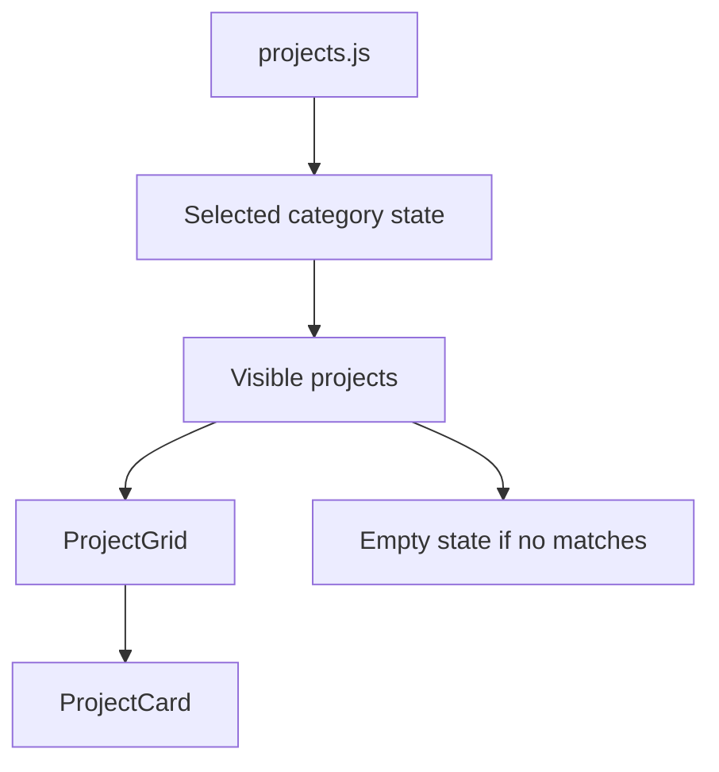

# Chapter 6 - Projects from data

Projects are the heart of a software engineer portfolio. They show what you can build better than a list of technologies ever can.

> **Principle.** A project card should make someone want to inspect the work, not merely count the tools.

This chapter builds the projects page the React way: project information lives in a data file, and the UI renders cards from that data. You also add category filtering, which introduces state for a real reason.

Quality beats quantity here. Aim for **3-6 strong projects**, not a wall of half-finished cards. A small set of finished, explainable projects is stronger than ten tutorial clones.

## Where we're headed

By the end, your portfolio has a projects page, a `projects.js` data file, reusable project cards, category filters, and an empty state when no project matches.



## Before you build

> **Mandatory read.** Read the DevWeekends React chapters on state, events, and lists/keys: https://resources.devweekends.com/courses/react-crash-course/03-state-hook, https://resources.devweekends.com/courses/react-crash-course/04-events, and https://resources.devweekends.com/courses/react-crash-course/05-lists-keys.

> **Daily guideline.** Read "Think About Real Users" and "Test Edge Cases" in `Daily_Software_Development_Guidelines.md`.

> **Hint - empty states.** A blank grid looks broken. Empty state text should tell the visitor what happened, such as "No projects match this category yet."

Before creating the projects page, choose your 3-6 strongest projects and write one line for each: problem, contribution, and result. If a project cannot answer those yet, it may not belong in the first version.

## Step 1 - Create the projects page and data file

Create:

```txt
src/pages/
  Projects.jsx

src/data/
  projects.js
```

Each project should have enough information to be useful:

```txt
id
title
category
description
tech
github
live
featured
problem
solution
contributions
challenges
results
```

Do not include fake links unless clearly marked as placeholders. Broken portfolio links are louder than missing links.

## Step 2 - Create project components

Create:

```txt
src/components/
  ProjectCard.jsx
  ProjectGrid.jsx
  ProjectFilter.jsx
```

`ProjectCard` displays one project. `ProjectGrid` displays the list. `ProjectFilter` lets visitors choose a category.

The tempting shortcut is to put filtering logic, card markup, and layout all inside `Projects.jsx`. That works briefly, then the page becomes difficult to scan. Split by responsibility.

## Step 3 - Render projects from the data file

Import the projects array and render a card for each project.

React needs a stable `key` when rendering a list. Use a stable project `id`, not the array index. An index key can behave badly when items are filtered, reordered, or inserted.

## Step 4 - Add category filtering with state

Use state for the selected category. State is data React remembers between renders. Here, it is needed because the visitor can change the filter.

The flow should be:

```txt
Visitor clicks category
  -> selected category changes
  -> visible projects are recalculated
  -> project grid re-renders
```

Include an "All" option. If no projects match a category, show a clear empty message instead of a blank page.

This is one of the daily habits: handle empty states. A blank page makes users wonder whether the app broke. A clear message tells them exactly what happened.

## Step 5 - Improve project descriptions

A weak project description says:

```txt
A portfolio website built with React.
```

A stronger one says:

```txt
A responsive React portfolio with reusable components, project filtering,
dynamic project detail pages, form validation, and deployment.
```

Describe what the project does, what you built, and what the visitor should inspect.

For each important project, add case-study fields that answer:

```txt
Problem:       What problem did this project solve?
Solution:      How did you solve it?
Contribution:  What did you personally build?
Challenge:     What was difficult?
Result:        What improved, shipped, or became clearer?
```

If you do not have metrics yet, do not invent them. Use honest outcomes: deployed successfully, improved Lighthouse score, reduced repeated markup, added validation, or learned how to handle API failures.

## What your screen should show

The projects page should show a filter control, a grid of project cards, and a clear empty state when a filter has no matches. Each card should make the project understandable without opening the detail page.

## Small challenge

Pick your weakest project card and rewrite it around the problem it solves, not the stack it uses.

Suggested commit:

```bash
git commit -m "feat: render projects from data"
```

## Definition of Done

- [ ] `src/pages/Projects.jsx` exists.
- [ ] `src/data/projects.js` exists with realistic project objects.
- [ ] The portfolio shows 3-6 strong projects, not a long list of weak or unfinished ones.
- [ ] `ProjectCard`, `ProjectGrid`, and `ProjectFilter` exist or equivalent reusable components exist.
- [ ] Projects render from the data file.
- [ ] Categories can filter the visible projects.
- [ ] The "All" category resets the filter.
- [ ] Empty filter results show a message.
- [ ] Project links are real or clearly marked as unavailable.
- [ ] Important projects include problem, solution, contribution, challenge, and result fields or equivalent detail.
- [ ] You tested at least one category with zero matching projects.
- [ ] You made a commit for this chapter.

> **Log it.** In `learning-log/06-projects-from-data.md`: (1) Why store projects in a data file? (2) What is state doing in this chapter? (3) Why should list keys use stable IDs? (4) How did you improve your project descriptions?

---

Next: make the portfolio behave like a multi-page app. -> **[Chapter 7 - Routing and project details](07-routing-and-project-details.md)**
