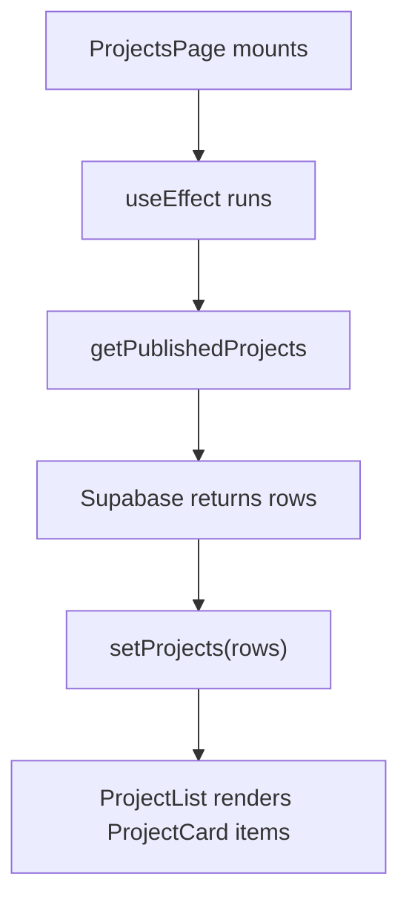

# Chapter 06 - Projects from Supabase

You now have public routes. The projects page is where the portfolio starts proving skill. Hard-coded project cards are easy, but they do not exercise the backend you built. This chapter makes the public project experience database-backed.

## Where we're headed

By the end, `/projects` loads published projects from Supabase, orders featured work first, supports useful empty/loading/error states, and `/projects/:slug` loads one published project by slug.

## The public data rule

Bad:

```txt
Fetch all projects and hide drafts in React.
```

Problem: the browser still receives draft data. If the content is private, hiding it after the fetch is too late.

Better:

```txt
Supabase query asks for published projects.
RLS also prevents draft projects from being returned publicly.
React only receives what visitors are allowed to see.
```

## New ideas before you build

This chapter is the first place where the page stops being static. Learn the one idea you need before building: the page must fetch data after it appears.

### `useEffect` for loading data

**Real-life analogy:** imagine opening a shop in the morning. First you unlock the door and turn on the lights. Then, after the shop is open, you check the stock room and bring products to the shelves. `useEffect` is like that second step: it runs after React has shown the page, so the component can go do something outside the first render, such as fetching projects from Supabase.

**General idea:** React components should render UI from current data. When a component needs to talk to something outside React, such as Supabase, the browser, a timer, or a subscription, that work belongs in an effect. The dependency array tells React when to run the effect again. An empty array, `[]`, means "run this once when the component appears."

```tsx
import { useEffect, useState } from "react";

function ProjectsPage() {
  const [projects, setProjects] = useState([]);
  const [isLoading, setIsLoading] = useState(true);
  const [error, setError] = useState("");

  useEffect(() => {
    async function loadProjects() {
      try {
        setIsLoading(true);
        const rows = await getPublishedProjects();
        setProjects(rows);
      } catch (error) {
        setError("Projects could not be loaded.");
      } finally {
        setIsLoading(false);
      }
    }

    loadProjects();
  }, []);

  if (isLoading) return <p>Loading projects...</p>;
  if (error) return <p>{error}</p>;

  return <ProjectList projects={projects} />;
}
```

Study more: [React Crash Course - Components and Props](https://resources.devweekends.com/courses/react-crash-course/02-components-props)

Diagram:



**Big word alert:** **side effect** means work React does outside pure rendering, such as fetching from Supabase, setting up a subscription, reading from the browser, or starting a timer.

## Daily guideline

From `Daily_Software_Development_Guidelines.md`: **separate business logic from UI**. Keep Supabase queries in a project data module and keep `ProjectCard` focused on display. The card should not know how to talk to the database; it should receive a project and render it clearly.

## Build it

Create a project data module in `src/features/projects/`. Keep Supabase query logic out of the visual card component. The list query should request published projects, order featured projects first, and then order by a stable display field or creation date.

Use clear function contracts:

```ts
type Project = {
  id: string;
  slug: string;
  title: string;
  summary: string;
  status: "published";
  featured: boolean;
  imagePath: string | null;
  imageAlt: string | null;
};

async function getPublishedProjects(): Promise<Project[]> {}

async function getPublishedProjectBySlug(
  slug: string,
): Promise<Project | null> {}
```

The UI should not know how the Supabase query is written. It should only know whether it received projects, loading, an error, or no matching row.

### Implementation sketch

Use this as a shape, not a copy-paste answer. The important idea is that the data module owns Supabase details and the page owns UI states.

```txt
src/features/projects/
  projectTypes.ts
  projectApi.ts
  ProjectCard.tsx
  ProjectsPage.tsx
  ProjectDetailPage.tsx
```

`projectApi.ts` should translate database rows into the `Project` shape your UI expects:

```ts
import { supabase } from "../../lib/supabaseClient";
import type { Project } from "./projectTypes";

type ProjectRow = {
  id: string;
  slug: string;
  title: string;
  summary: string;
  status: "published";
  featured: boolean;
  image_path: string | null;
  image_alt: string | null;
};

function mapProjectRow(row: ProjectRow): Project {
  return {
    id: row.id,
    slug: row.slug,
    title: row.title,
    summary: row.summary,
    status: row.status,
    featured: row.featured,
    imagePath: row.image_path,
    imageAlt: row.image_alt,
  };
}

export async function getPublishedProjects(): Promise<Project[]> {
  const { data, error } = await supabase
    .from("projects")
    .select("id, slug, title, summary, status, featured, image_path, image_alt")
    .eq("status", "published")
    .order("featured", { ascending: false })
    .order("created_at", { ascending: false });

  if (error) throw new Error(error.message);
  return (data ?? []).map(mapProjectRow);
}
```

For the detail page, use the same pattern but return `null` when no row exists:

```ts
export async function getPublishedProjectBySlug(
  slug: string,
): Promise<Project | null> {
  const { data, error } = await supabase
    .from("projects")
    .select("id, slug, title, summary, status, featured, image_path, image_alt")
    .eq("status", "published")
    .eq("slug", slug)
    .maybeSingle();

  if (error) throw new Error(error.message);
  return data ? mapProjectRow(data) : null;
}
```

In the page component, keep the states explicit:

```tsx
if (isLoading) return <p>Loading projects...</p>;
if (error) return <p>Projects could not be loaded.</p>;
if (projects.length === 0) return <p>No projects published yet.</p>;
```

The exact table columns may differ from your migration. If they do, update the select list and mapper deliberately instead of passing raw database rows through your UI.

### As you build

Use these React tools when the task asks for them:

**`useState`:** stores changing screen data such as filters, loading flags, errors, and fetched projects.

```tsx
const [selectedTag, setSelectedTag] = useState("all");
```

**Lists and `key`:** `.map()` turns rows into UI, and `key` gives each item a stable identity.

```tsx
{projects.map((project) => (
  <ProjectCard key={project.id} project={project} />
))}
```

**Events:** `onClick`, `onChange`, and `onSubmit` run code after the user does something.

```tsx
<button type="button" onClick={() => setSelectedTag("react")}>
  React
</button>
```

**Comparison:** state belongs to a component and can change over time. Props are values passed into a component by its parent.

Render cards that answer:

```txt
What was built?
What problem did it solve?
What technologies were used?
Where can I view code or demo?
What changed because of this project?
```

Do not let the card become a wall of badges. A visitor is scanning for evidence, not collecting buzzwords.

For the detail route, fetch by slug and published status. If no project matches, show a clear missing state.

## Empty, loading, and error states

A blank grid looks broken.

Good:

```txt
No projects match this category yet.
```

Better, when filtering:

```txt
No React projects match this filter yet. Clear filters to see all work.
```

The page should show loading while the request is in progress and a human-readable error if Supabase fails.

## Mandatory read

Read the React topic explanations above and then study the linked `resources.devweekends.com` pages for any topic that still feels unclear. Required: project cards depend on `useEffect`, state, mapped lists, keys, and filter events.

## Definition of Done

- [ ] Published projects render from Supabase.
- [ ] Draft projects do not appear publicly.
- [ ] Featured projects can appear first.
- [ ] Project data fetching lives outside visual card components.
- [ ] List and detail data functions have clear return types.
- [ ] Project detail pages load by slug.
- [ ] Missing, loading, error, and empty states are visible and useful.
- [ ] The project card copy explains outcomes, not only tools.

> **Log it.** In `learning-log/06-projects-from-supabase.md`, explain why drafts must be blocked by the database, not only hidden in React.

## Learning bridge

Use this as a flexible pause point before, during, or after the chapter work. Pick **one or two**, not all of them. Skip the rest without guilt if your Definition of Done is complete.

**Quiz:** what should the UI show for each state: loading, Supabase error, no projects, and project slug not found?

**Exercise:** render three fake projects first, add a filter button, then replace only the data source with Supabase. The card UI should not need to know which source was used.

**Data check:** seed one published project and one draft project with the same technology tag. Confirm the filter never reveals the draft.

**Motivation pause:** from `Software_Engineering_Community_Affirmations.md`: "Building teaches lessons that theory cannot." Once this page renders real data, the backend stops being an idea and becomes part of your app.

Next: projects show what you built. Articles show how you think. -> **[Chapter 07 - Articles, comments, search, and pagination](07-articles-comments-search.md)**
