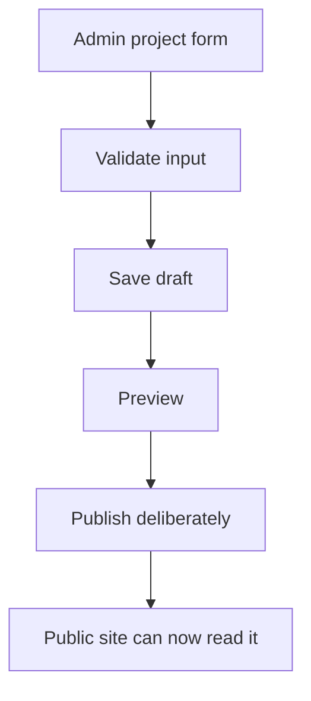

# Chapter 09 - Admin project CRUD

The owner can sign in. Now the admin dashboard needs its first real job: managing portfolio projects. CRUD means create, read, update, and delete, but the production-shaped version includes validation, publish states, confirmations, and public preview checks.

## Where we're headed

By the end, the owner can add, edit, publish, unpublish, and delete portfolio projects from the admin dashboard.

## The CRUD trap

Bad:

```txt
one form
no validation
delete button immediately deletes
all projects public by default
```

Problem: half-written projects leak publicly, destructive actions are too easy, and invalid records create broken public pages.

Better:

```txt
draft first
validate required fields
publish deliberately
confirm delete
preview public result
```

## New ideas before you build

### CRUD

**Real-life analogy:** managing a notebook means you can add a note, read it, edit it, and remove it. CRUD is the software version: create, read, update, delete.

**General idea:** admin project management needs all four operations, plus validation, confirmation, and a draft/published status.

```ts
await supabase.from("projects").insert(projectInput);
await supabase.from("projects").select("*");
await supabase.from("projects").update(changes).eq("id", id);
await supabase.from("projects").delete().eq("id", id);
```

**Big word alert:** **CRUD** means Create, Read, Update, Delete. It is the basic set of actions most admin tools need.

**Comparison:** create vs update: create makes a new row. Update changes an existing row. A form can look similar for both, but the database operation and edge cases are different.

Study more: [Frontend Interview Questions - React Fundamentals](https://resources.devweekends.com/resources/frontend-interview-qs)

### Form state

**Real-life analogy:** a paper form keeps what you wrote in each box until you submit it. React form state stores those boxes in code.

**General idea:** controlled inputs keep form values in state, which lets you validate, save drafts, and show errors.

```tsx
const [title, setTitle] = useState("");

<input
  value={title}
  onChange={(event) => setTitle(event.target.value)}
/>;
```

Study more: [React Crash Course - Components and Props](https://resources.devweekends.com/courses/react-crash-course/02-components-props)

## Daily guideline

From `Daily_Software_Development_Guidelines.md`: **protect against double submissions** and **think about real users**. Disable the save button while a project is being created or updated. Show success or failure clearly. A user who clicks twice because nothing happened should not accidentally create duplicate projects.

## Build it

Create `/admin/projects`. Load all owner-visible projects, including drafts. Add a project form with title, slug, summary, body/description, technologies, links, featured flag, status, and image path placeholder.

Validation should catch missing title, missing slug, duplicate slug, invalid URLs, and weak summaries. A project summary should say what changed, not only what tech was used.

**Validation exercise:** submit the project form with an empty title, bad URL, duplicate slug, and too-short summary. The form should fail before creating broken public content.

Add create and edit flows. Add publish/unpublish as a status update. Add delete with confirmation. If you want a safer production habit, use archive or soft delete instead of hard delete.

**Assignment:** create a manual test checklist for project CRUD: create draft, edit draft, publish, unpublish, delete/archive, invalid URL, duplicate slug, signed-out write attempt.

### Implementation sketch

Use a small admin feature folder so the list, form, validation, and database calls do not blur together:

```txt
src/features/adminProjects/
  adminProjectTypes.ts
  adminProjectApi.ts
  validateProjectInput.ts
  AdminProjectsPage.tsx
  ProjectForm.tsx
  ProjectRowActions.tsx
```

Start with a form state shape that matches what the owner edits, not every database column:

```ts
type ProjectFormValues = {
  title: string;
  slug: string;
  summary: string;
  description: string;
  technologies: string[];
  demoUrl: string;
  codeUrl: string;
  featured: boolean;
  status: "draft" | "published";
};
```

Put validation in a plain function first. You can replace it with zod later, but the rules should be clear either way:

```ts
type ValidationErrors = Partial<Record<keyof ProjectFormValues, string>>;

function validateProjectInput(values: ProjectFormValues): ValidationErrors {
  const errors: ValidationErrors = {};

  if (!values.title.trim()) errors.title = "Title is required.";
  if (!values.slug.trim()) errors.slug = "Slug is required.";
  if (values.summary.trim().length < 40) {
    errors.summary = "Summary should explain the outcome, not only tools.";
  }
  if (values.demoUrl && !values.demoUrl.startsWith("https://")) {
    errors.demoUrl = "Demo URL should start with https://";
  }

  return errors;
}
```

The form submit flow should be predictable:

```txt
submit
  -> validate fields
  -> if errors, show errors and do not call Supabase
  -> disable submit button
  -> call createProjectDraft or updateProject
  -> show success or error
  -> re-enable submit button
```

Keep Supabase mutations in `adminProjectApi.ts`:

```ts
export async function createProjectDraft(values: ProjectFormValues) {
  return supabase.from("projects").insert({
    title: values.title,
    slug: values.slug,
    summary: values.summary,
    description: values.description,
    technologies: values.technologies,
    demo_url: values.demoUrl || null,
    code_url: values.codeUrl || null,
    featured: values.featured,
    status: "draft",
  });
}

export async function publishProject(id: string) {
  return supabase
    .from("projects")
    .update({ status: "published" })
    .eq("id", id);
}
```

In the UI, wire actions through small handlers:

```tsx
<ProjectForm
  initialValues={emptyProjectForm}
  onSubmit={async (values) => {
    const errors = validateProjectInput(values);
    if (Object.keys(errors).length > 0) {
      setErrors(errors);
      return;
    }

    setIsSaving(true);
    try {
      await createProjectDraft(values);
      setStatusMessage("Draft saved.");
    } finally {
      setIsSaving(false);
    }
  }}
/>
```

This is still not the whole solution. You still need to connect your actual schema, render errors beside fields, refresh the list after mutations, and confirm destructive actions.

### Concurrency check

**Big word alert:** **concurrency** means two things happen around the same time. In admin CRUD, the most common version is two browser tabs editing the same project.

**Real-life analogy:** imagine two people editing the same document. If one person changes the title and another changes the summary, the app needs to avoid silently overwriting someone else's work.

For this beginner project, start with a simple `updated_at` guard. When you load a project for editing, keep its current `updated_at` value. When you save, update only if the row still has that same value:

```ts
export async function updateProject(
  id: string,
  values: ProjectFormValues,
  lastSeenUpdatedAt: string,
) {
  const { data, error } = await supabase
    .from("projects")
    .update({
      title: values.title,
      slug: values.slug,
      summary: values.summary,
      description: values.description,
      technologies: values.technologies,
      demo_url: values.demoUrl || null,
      code_url: values.codeUrl || null,
      featured: values.featured,
      status: values.status,
    })
    .eq("id", id)
    .eq("updated_at", lastSeenUpdatedAt)
    .select("id, updated_at")
    .maybeSingle();

  if (error) throw error;
  if (!data) {
    throw new Error("This project changed in another tab. Reload before saving.");
  }

  return data;
}
```

This is not advanced locking. It is a practical first safety habit: do not overwrite a record if it changed after you loaded it.

Diagram:



## Real developer mistake

Mistake: publish automatically after saving.

Why it is bad: the owner may save an incomplete draft while still writing.

Fix: save as draft by default, then publish with a separate deliberate action.

**Blog prompt:** write three paragraphs on `Why save does not always mean publish`.

## Definition of Done

- [ ] Admin project list shows owner-visible projects.
- [ ] Owner can create a draft project.
- [ ] Owner can edit project fields.
- [ ] Owner can publish and unpublish.
- [ ] Delete or archive requires confirmation.
- [ ] Edit flow warns instead of overwriting when the project changed elsewhere.
- [ ] Signed-out users cannot write projects.
- [ ] Public page shows only published projects.

> **Log it.** In `learning-log/09-admin-project-crud.md`, explain why draft/published status is safer than making every saved project public.

**CRUD exercise:** perform the full lifecycle on one project: create draft, preview, publish, edit, unpublish, archive/delete. After each step, check both the admin page and public page.

**Motivation pause:** from `Software_Engineering_Community_Affirmations.md`: "Every project teaches something valuable." CRUD looks ordinary, but this is where you learn how real owner workflows are protected.

Next: projects are manageable. Now give the owner the same power over articles. -> **[Chapter 10 - Admin article CRUD](10-admin-article-crud.md)**
