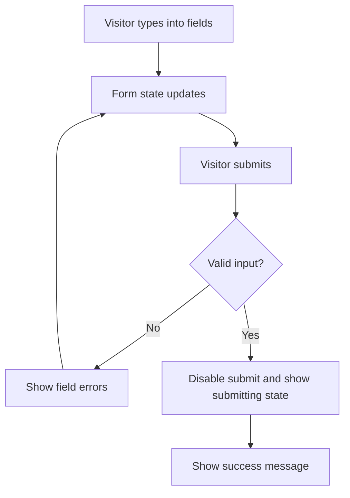

# Chapter 9 - The contact form

A portfolio should make contact easy. This chapter builds a contact page with a controlled form and validation.

> **Principle.** A contact page fails if the visitor wants to reach you and has to work for it.

You are not building a backend or sending real email from your own server. The goal is frontend form behavior: state, validation, errors, disabled submit, and a success state.

Use a contact form only if it behaves reliably. A broken contact form is worse than no form. Email, LinkedIn, and GitHub links should always be present as direct fallback paths.

## Where we're headed

By the end, visitors can fill a contact form, see useful validation errors, submit valid input, and see a success message.



## Before you build

> **When you're stuck.** Forms create emotional noise because one small typo can make the whole thing feel broken. Slow it down: write the current form state on paper, then the validation rule, then the error you expect to see. If those three do not line up, you have found the next question to answer.

Before creating `ContactForm.jsx`, write the four fields and their validation rules in your learning log. The form should start as behavior requirements, not markup.

> **Apply this habit.** Read "Think About Real Users" in [Daily_Software_Development_Guidelines.md](../Daily_Software_Development_Guidelines.md), then use it to decide what a visitor needs when they are trying to contact you quickly.

## Step 1 - Create the contact page and components

Create:

```txt
src/pages/
  Contact.jsx

src/components/
  ContactForm.jsx
  InputField.jsx
  TextAreaField.jsx
  FormError.jsx
```

If you prefer fewer components, keep the responsibilities clear. Repeated field markup should not become a mess inside one giant form.

## Step 2 - Define the fields

You now have the contact page and form files; next, define exactly what information the form should collect.

> **Reading before this step.** Read the validation habit "Validate Input Everywhere" in [Daily_Software_Development_Guidelines.md](../Daily_Software_Development_Guidelines.md). Focus on why the interface should reject incomplete or unclear messages before pretending the form succeeded.

The form needs:

```txt
name
email
subject
message
```

Validation rules:

```txt
name      -> required
email     -> required and valid-looking email
subject   -> required
message   -> at least 20 characters
```

The weak approach is to accept anything and only hope the visitor typed correctly. A better interface gives feedback where the mistake happens.

## Step 3 - Use controlled inputs

You now have fields and validation rules; next, connect the fields to React state.

> **Reading before this step.** Read DevWeekends React forms: https://resources.devweekends.com/courses/react-crash-course/06-forms. Focus on controlled inputs and how form values live in state.

A controlled input is an input whose value is stored in React state. When the user types, state updates; when state updates, the input reflects it.

Use controlled inputs here because the form needs validation and a success reset.

Do not manually read DOM values at submit time unless you can explain why. React state gives you one clear source of truth for the form.

## Step 4 - Show errors clearly

You now have form state; next, turn invalid state into clear feedback.

> **Hint - validation.** Keep validation logic separate from JSX if the form becomes hard to read. A small helper function that returns an errors object is easier to explain than validation scattered through markup.

Errors should appear near the relevant field. They should be specific:

```txt
Email is required.
Enter a valid email address.
Message must be at least 20 characters.
```

Do not show all errors before the user interacts if that makes the page noisy. Choose a simple rule: validate on submit, then update errors as the user fixes fields.

Example:

```txt
Weak:
Invalid input.

Stronger:
Enter a valid email address.

Weak:
Message error.

Stronger:
Message must be at least 20 characters so I have enough context to reply.
```

## Step 5 - Submit without pretending there is a backend

You now have validation feedback; next, define what a successful frontend-only submit should do.

On valid submit:

- show a success message;
- clear the form or keep it, depending on your product choice;
- prevent double submit with a brief submitting state if you simulate delay.

If you later connect a form service, that belongs after this course. For now, be honest: this is frontend validation and UI behavior.

Also protect against double submissions. If the form has a submitting state, disable the submit button while it is processing. Users double-click, networks feel slow, and good interfaces make the current state visible.

Example:

```txt
Weak:
Submit button stays active while the form is processing.

Stronger:
Button text changes to "Sending..." and the button is disabled until the
submit flow finishes.
```

## What your screen should show

The contact page should show direct contact links and a form. Empty fields, invalid email, and short messages should show specific errors. A valid submit should show success and prevent repeated submission.

## Small challenge

Make the error messages sound helpful instead of scolding. A visitor made a mistake; they did not fail an exam.

Suggested commit:

```bash
git commit -m "feat: add contact form validation"
```

## Definition of Done

- [ ] `src/pages/Contact.jsx` exists.
- [ ] Contact form fields exist for name, email, subject, and message.
- [ ] Inputs are controlled by React state.
- [ ] Required fields show useful errors.
- [ ] Invalid email shows a useful error.
- [ ] Short messages are rejected.
- [ ] Valid submit shows a success state.
- [ ] Double-submit is prevented or handled.
- [ ] Contact links such as email, GitHub, or LinkedIn are present.
- [ ] The page still gives visitors a direct contact path even if the form is not connected to real email delivery.
- [ ] You tested empty, invalid, short, valid, and repeated-submit cases.
- [ ] You made a commit for this chapter.

> **Log it.** In `learning-log/09-contact-form.md`: (1) What is a controlled input? (2) Why validate before accepting a form submission? (3) Which unhappy paths did you test? (4) What would change if this form connected to a real backend?

---

Next: fetch live data. -> **[Chapter 10 - The GitHub/API page](10-github-api-page.md)**
