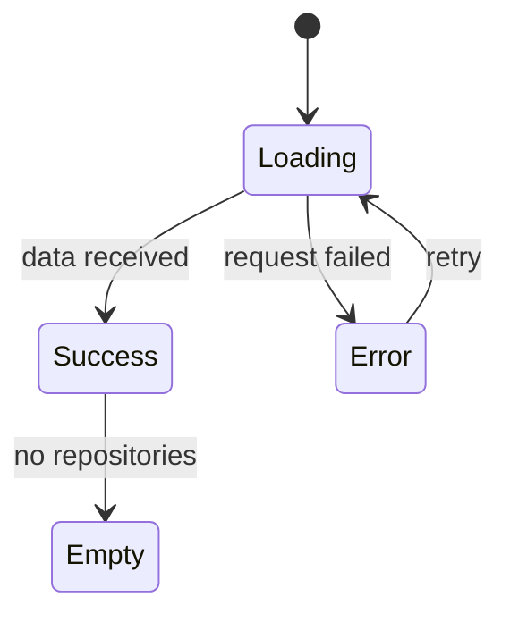

# Chapter 10 - The GitHub/API page

So far, your portfolio data has been local. That is good: local data is predictable while you learn components, props, state, and routing. Now you add one external data flow.

This chapter builds a GitHub/API page that fetches public data and handles the four states every real data UI needs: loading, success, error, and empty.

## Where we're headed

By the end, your portfolio fetches public repository data from GitHub or a simple mock API, renders cards, and handles failed or empty responses gracefully.



## Before you build

> **Mandatory read.** Read the DevWeekends `useEffect` chapter: https://resources.devweekends.com/courses/react-crash-course/07-useeffect.

> **Mandatory read.** Read one focused article on `useEffect` cleanup if you want to understand why effects can need cleanup. For this simple page, focus first on loading/error/success.

> **Optional deep dive.** If you want to go deeper after the page works, skim the hooks section of the DevWeekends React interview deep dive: https://resources.devweekends.com/resources/interview-questions/react. Treat it as review, not as required beginner material.

> **Hint - public API limits.** If GitHub rate limits you, switch temporarily to mock data or another public API. The learning goal is fetch state, not fighting an API quota.

> **When you're stuck.** Say the data flow out loud like a rubber duck explanation: "The page renders, loading becomes true, fetch starts, success stores data, failure stores error, loading becomes false." Point to where each step happens in your code. The missing step is usually the bug.

Before writing `fetch`, draw the four states in your learning log: loading, success, error, and empty. You are designing the data flow before writing the effect.

## Step 1 - Choose the API

Recommended:

```txt
GitHub public repositories API
```

You can also use JSONPlaceholder, DummyJSON, or a mock API if GitHub rate limits or setup gets in the way. Choose one and write it in your learning log.

Do not use private tokens in this beginner portfolio. Public data is enough, and secrets do not belong in a frontend bundle.

## Step 2 - Create the page and components

Create:

```txt
src/pages/
  GitHub.jsx

src/components/
  RepoCard.jsx
  Loader.jsx
  ErrorMessage.jsx
```

Each repo card should show useful public fields:

```txt
name
description
language
stars
link
```

## Step 3 - Fetch with `useEffect`

`useEffect` lets a component run code after rendering. Fetching data is one common use.

The flow:

```txt
Page renders
  -> loading becomes true
  -> fetch starts
  -> success: data is stored
  -> failure: error is stored
  -> loading becomes false
```

Use state for:

```txt
repos
loading
error
```

The weak approach is to fetch and assume it always works. Real networks fail. The better approach is to design the four states from the start.

This chapter is the daily guideline "design for failure" made visible. A portfolio reviewer should not see a broken blank area because GitHub is slow, rate-limited, or temporarily unavailable.

## Step 4 - Render all data states

Your page should show:

- loading UI while the request is in progress;
- repo cards when data exists;
- an empty message when the response is valid but has no repos;
- an error message when the request fails.

You may add a retry button if you want, but it is not required.

## Step 5 - Avoid unnecessary complexity

Do not add a data-fetching library for this course. A simple `fetch` call is enough. Libraries like TanStack Query are excellent for larger apps, but using one here would hide the basic state model you need to learn.

## Definition of Done

- [ ] `src/pages/GitHub.jsx` exists.
- [ ] The page fetches public API data.
- [ ] Loading state is visible.
- [ ] Success state renders useful cards.
- [ ] Error state is visible when the request fails.
- [ ] Empty state is handled.
- [ ] The UI makes loading, success, error, and empty states visually distinct.
- [ ] No private API token is committed or exposed.
- [ ] The page is reachable through routing and navigation.
- [ ] You made a commit for this chapter.

> **Log it.** In `learning-log/10-github-api-page.md`: (1) Which API did you choose, and why? (2) What are the four UI states for fetched data? (3) Why should private tokens not be placed in frontend code? (4) What happened when you tested failure?

---

Next: polish the experience. -> **[Chapter 11 - Responsive polish and accessibility](11-responsive-polish-and-accessibility.md)**
