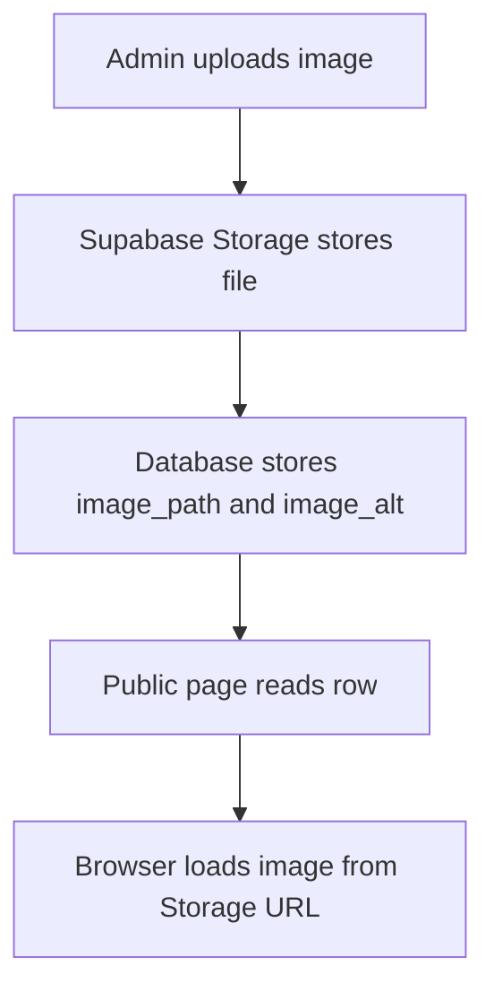

# Chapter 11 - Image storage

Projects and articles need images. The tempting path is to paste image URLs or store files as database blobs. The production-shaped path is object storage: the database stores metadata and paths; storage holds the file.

## Where we're headed

By the end, project and article images upload to Supabase Storage, paths are saved in database rows, alt text is stored, and public pages render images with fallbacks.

## Why files do not belong in rows

Bad:

```txt
projects.image_base64 = giant encoded file
```

Problem: rows become huge, queries get heavier, backups bloat, and the database starts doing file storage work badly.

Better:

```txt
Supabase Storage bucket stores the file
projects.image_path stores the path
projects.image_alt stores the human description
```

## New ideas before you build

### Object storage

**Real-life analogy:** keep customer records in a filing cabinet, but keep large posters in a storage room. The record only needs to know where the poster is.

**General idea:** the database should store image metadata and paths. Supabase Storage should store the actual files.

```txt
Storage: projects/portfolio-dashboard.png
Database: image_path = "projects/portfolio-dashboard.png"
```

Study more: [AWS Core Concepts - Storage and Cloud Basics](https://resources.devweekends.com/aws/core-concepts)

### Alt text

**Real-life analogy:** alt text is a spoken description of an image for someone who cannot see it.

**General idea:** meaningful images need useful alt text. Decorative images can be marked decorative, but project screenshots usually need descriptions.

```tsx

```

Study more: [Accessibility Overview](https://resources.devweekends.com/courses/angular-crash-course/20-accessibility)

## Daily guideline

From `Daily_Software_Development_Guidelines.md`: **name things clearly**. Image paths and alt text should help future-you understand what the file is. Prefer `projects/<project-id>/dashboard-overview.png` over `image1.png`, and write alt text that describes the image's purpose.

## Public or private?

Portfolio project/article images are meant to be public. A public bucket is reasonable if only the owner can upload and paths are safe. Private files, such as invoices or personal documents, would need signed URLs. Do not use private complexity where public content is intended.

## Build it

Create buckets for project images and article images, or one organized public content bucket with prefixes:

```txt
projects/<project-id>/<filename>
articles/<article-id>/<filename>
```

Add storage policies so only the authenticated owner can upload/update/delete. Public users can read public images.

Add upload controls in project and article admin forms. Show selected filename, loading state, upload error, preview, and saved path. Store alt text with the content record.

## Real developer mistake

Mistake: save the image URL but no alt text.

Why it is bad: accessibility suffers, and broken images have no meaningful fallback.

Fix: require useful alt text for meaningful images.

## Definition of Done

- [ ] Supabase Storage bucket exists.
- [ ] Owner can upload project images.
- [ ] Owner can upload article images.
- [ ] Public pages render images from saved paths.
- [ ] Upload loading and error states exist.
- [ ] Alt text is stored and rendered.
- [ ] Signed-out users cannot upload.

> **Log it.** In `learning-log/11-image-storage.md`, explain why storage paths belong in the database but file bytes do not.

## Between chapters

Optional pause. Pick **one or two**, not all of them. Skip the rest without guilt if your Definition of Done is complete.

**Mini assignment:** upload one intentionally oversized image and one broken/unsupported file type in development. Write what the UI should show for each.

**Quiz:** what is stored in the database: image bytes, image path, alt text, upload status, or bucket policy? Explain each choice.

**Storage exercise:** upload an image, replace it, then remove or archive it. Confirm the database path and public rendering stay consistent.

**Accessibility exercise:** temporarily remove image alt text and use that discomfort to write a better description. Restore useful alt text before moving on.

**Comparison:** database row vs object storage file: the row stores facts and paths. Object storage holds the actual image bytes.

**Big word alert:** **metadata** means data about data. For an image, metadata might include path, alt text, file size, content type, and upload time.

**Diagram:**



Next: visitors need to contact the owner. Email alone is not enough; store first, then notify. -> **[Chapter 12 - Contact Edge Function and Brevo](12-contact-edge-function-brevo.md)**
