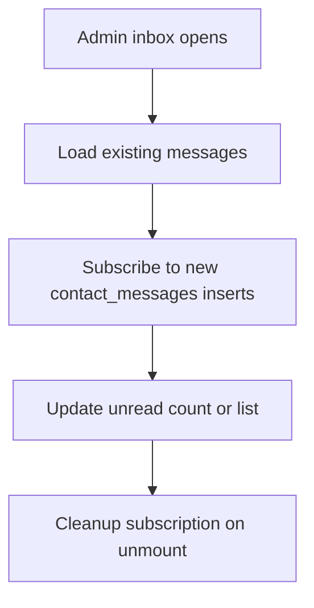

# Chapter 13 - Contact inbox and Realtime

The contact form now stores messages and sends Brevo notifications. That email is useful, but it should not be the only place messages live. The owner needs an inbox inside the admin dashboard.

## Where we're headed

By the end, the admin dashboard has a contact inbox where the owner can read messages, mark them read, archive them, and see new messages arrive through Supabase Realtime.

## The inbox trap

Bad:

```txt
delete message after reading
```

Problem: the owner loses context, cannot track follow-up, and has no fallback if email was missed.

Better:

```txt
unread -> read -> archived
```

Status gives the owner workflow without destroying useful history.

## Build it

Create `/admin/messages`. Load existing messages first, ordered by newest. Render a list and detail panel. Show sender, subject, date, status, and message body.

Add actions:

```txt
mark as read
archive
restore from archive if you support archived view
```

Then add Realtime. Subscribe to inserts on `contact_messages` so new messages update the inbox or unread count without refresh. Always clean up the subscription when the component unmounts.

### `useEffect` cleanup for Realtime

**Real-life analogy:** imagine subscribing to a paid magazine. Starting the subscription is only half the job. If you move house or stop reading it, you must cancel it, otherwise the magazines keep arriving forever. A Realtime subscription is similar: the component starts listening when it appears, and it must unsubscribe when it disappears.

**General idea:** `useEffect` can return a cleanup function. React runs that cleanup when the component unmounts or before the effect runs again. Use cleanup for subscriptions, timers, event listeners, and anything that keeps running outside the render.

```tsx
import { useEffect } from "react";

function ContactInbox() {
  useEffect(() => {
    const channel = supabase
      .channel("contact-messages")
      .on(
        "postgres_changes",
        { event: "INSERT", schema: "public", table: "contact_messages" },
        (payload) => {
          addMessageToInbox(payload.new);
        },
      )
      .subscribe();

    return () => {
      supabase.removeChannel(channel);
    };
  }, []);

  return <InboxList />;
}
```

Study more: [React Crash Course - Components and Props](https://resources.devweekends.com/courses/react-crash-course/02-components-props)

## Realtime expectations

Realtime is convenience, not the source of truth. If the socket disconnects, the owner should still see messages on refresh. Show a subtle disconnected state if needed.

## Definition of Done

- [ ] Admin inbox lists contact messages.
- [ ] Message detail view exists.
- [ ] Owner can mark messages read.
- [ ] Owner can archive messages.
- [ ] Realtime updates unread count or message list.
- [ ] Subscription cleanup exists.
- [ ] Signed-out users cannot read contact messages.

> **Log it.** In `learning-log/13-contact-inbox-realtime.md`, explain why the app loads existing messages before subscribing to new ones.

## Between chapters

Optional pause. Pick **one or two**, not all of them. Skip the rest without guilt if your Definition of Done is complete.

**Quiz:** if Realtime disconnects, should the inbox become empty, stay with existing loaded messages, or block the owner completely? Explain why.

**Assignment:** write a cleanup checklist for every subscription or event listener you add: where it starts, where it stops, and how you know it stopped.

**Realtime exercise:** open the inbox in one browser and submit the contact form in another. Confirm the new message appears without refresh, then refresh to prove stored data still loads.

**Cleanup exercise:** navigate away from the inbox and back several times. Confirm you do not create duplicate Realtime subscriptions.

**Comparison:** initial load vs Realtime update: initial load fetches the messages that already exist. Realtime listens for new changes after the page is open.

**Big word alert:** **subscription** means the app starts listening for future events. It should also unsubscribe when the component no longer needs those events.

**Diagram:**



Next: contact is handled. Now let visitors subscribe and send scheduled updates thoughtfully. -> **[Chapter 14 - Newsletter and Cron](14-newsletter-and-cron.md)**
