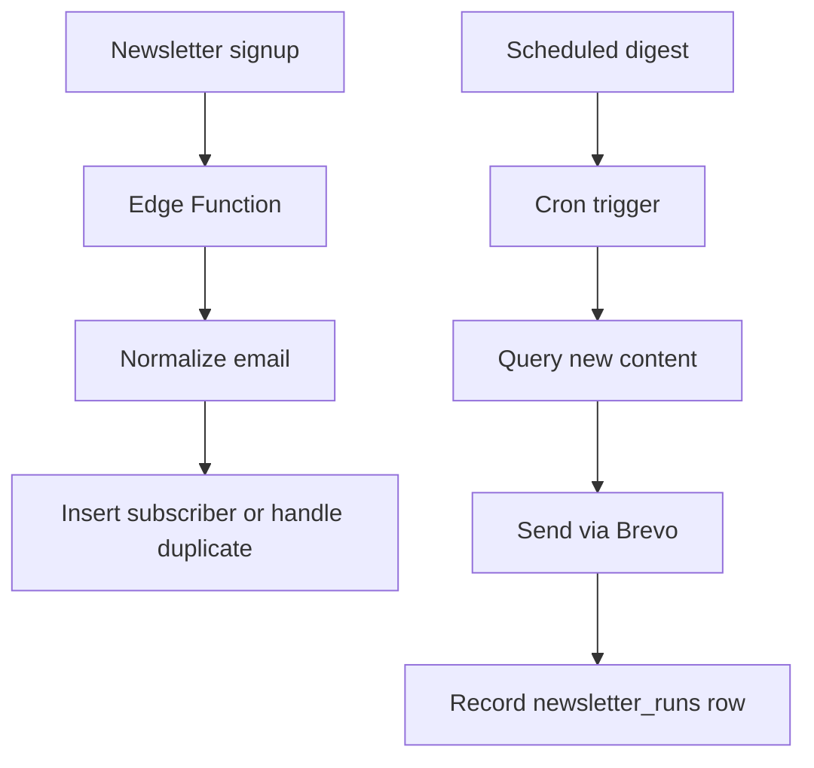

# Chapter 14 - Newsletter and Cron

Newsletter subscriptions sound small until you treat them like production data. A subscriber is trusting you with their email. Store it carefully, avoid duplicate rows, and send updates only from server-side scheduled work.

## Where we're headed

By the end, visitors can subscribe, subscriber emails are stored in Supabase, and a scheduled newsletter function is planned or implemented with Supabase Cron and Brevo.

## The newsletter trap

Bad:

```txt
newsletter form -> frontend calls email provider
```

Problem: provider keys leak, duplicates grow, and unsubscribes become messy.

Better:

```txt
newsletter form -> Edge Function -> newsletter_subscribers
scheduled function -> query new content -> Brevo send
newsletter_runs records result
```

## New ideas before you build

### Newsletter signup

**Real-life analogy:** signing a clipboard should not create three copies of your name. The organizer checks whether you already signed up and keeps one clean entry.

**General idea:** normalize email addresses, prevent duplicates, and keep subscriber status. Do not send provider secrets to the browser.

```ts
const email = input.email.trim().toLowerCase();
await saveSubscriber(email);
```

Study more: [Frontend Interview Questions - Forms and Validation](https://resources.devweekends.com/resources/frontend-interview-qs)

### Cron

**Real-life analogy:** an alarm clock runs at a scheduled time even when nobody is watching it.

**General idea:** Cron is scheduled server work. Use it for planned newsletter sends, cleanups, and recurring jobs.

```txt
Every Monday 09:00 -> find new articles -> send update email
```

Study more: [Supabase Cron documentation](https://supabase.com/docs/guides/cron) or a beginner-friendly cron syntax reference before scheduling real sends.

## Daily guideline

From `Daily_Software_Development_Guidelines.md`: **think about concurrency**. Two signup requests for the same email may arrive at nearly the same time. Normalize the email, add a unique constraint, and handle the duplicate case gracefully instead of trusting the UI to prevent it.

## Build it

Create a newsletter signup Edge Function. Validate email, normalize casing, prevent duplicates, and store status such as `active`, `unsubscribed`, or `bounced` if you support it.

Create `newsletter_runs` to track scheduled sends:

```txt
id
started_at
finished_at
status
article_count
subscriber_count
error_message
```

If implementing Cron now, schedule a Supabase function that looks for new published articles or projects and sends a digest through Brevo. If this is too much for the first pass, write the contract and leave the function as a planned advanced feature, but keep the schema ready.

## Revisit earlier decisions before Cron

Scheduled functions are not magic background code. They still depend on the database shape, RLS rules, secrets, and logging decisions you made earlier.

Before enabling a newsletter schedule, revisit:

```txt
Chapter 03 migrations
  -> newsletter_subscribers table exists
  -> newsletter_runs table exists
  -> unique normalized email constraint exists
  -> useful indexes exist for status and created_at

Chapter 04 RLS
  -> public visitors can subscribe only through the intended path
  -> subscribers are not publicly readable
  -> scheduled/server work uses server-side privileges carefully

Chapter 12 Edge Function habits
  -> Brevo key is a Supabase secret
  -> function responses are predictable
  -> failures are stored or logged

Chapter 19 maintenance
  -> newsletter_runs gives you a place to inspect success/failure
  -> dry-run mode exists before real sending
```

If a scheduled function needs service-role power, keep that power inside Supabase server-side code. Never move service-role keys into the browser just because a scheduled job needs stronger access.

## Definition of Done

- [ ] Newsletter signup stores validated emails.
- [ ] Duplicate emails are handled.
- [ ] Brevo keys remain server-side.
- [ ] `newsletter_runs` exists or is clearly planned.
- [ ] Cron workflow is documented.
- [ ] Migration, RLS, secrets, and logging assumptions were revisited before scheduling.
- [ ] The owner can explain what triggers an update email.

> **Log it.** In `learning-log/14-newsletter-and-cron.md`, explain why newsletters should be sent by scheduled server work, not by browser code.

## Learning bridge

Use this as a flexible pause point before, during, or after the chapter work. Pick **one or two**, not all of them. Skip the rest without guilt if your Definition of Done is complete.

**Assignment:** write the newsletter duplicate-email behavior before coding it. Should the user see an error, a success message, or "already subscribed"? Why?

**Reading:** revisit the "Think About Concurrency" section in `Daily_Software_Development_Guidelines.md`.

**Concurrency exercise:** submit the same email twice quickly. Confirm the database ends with one subscriber and the UI response is friendly.

**Cron exercise:** write a dry-run mode for the newsletter job that reports who would receive the email without sending it.

**Comparison:** immediate work vs scheduled work: immediate work happens because a user just clicked or submitted something. Scheduled work happens later because a clock or cron rule triggered it.

**Big word alert:** **concurrency** means two or more things can happen at nearly the same time. Duplicate newsletter signups are a simple place where concurrency can create bugs.

**Diagram:**



Next: the owner has content and messages. Now add lightweight visit insights without building a surveillance machine. -> **[Chapter 15 - Analytics and Realtime insights](15-analytics-realtime-insights.md)**
