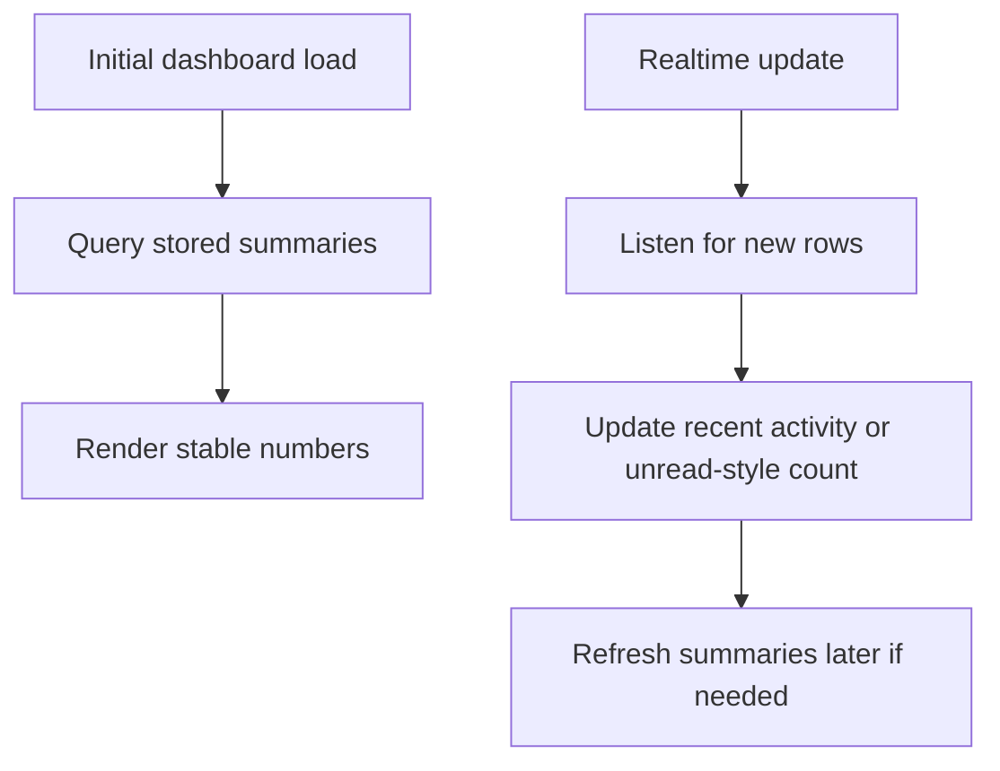
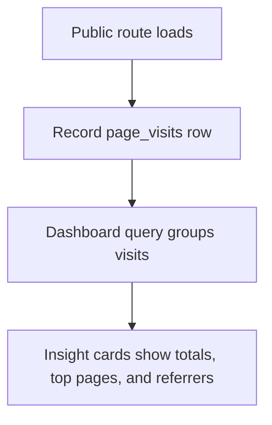

# Chapter 15 - Analytics and Realtime insights

A portfolio owner benefits from knowing which pages people visit. But analytics should be useful, minimal, and honest. You are not building an ad-tech platform. You are tracking enough to improve the portfolio.

## Where we're headed

By the end, the app records page visits, referrers, and coarse location metadata if available, and the dashboard shows basic insight cards. Realtime can update recent activity.

## The analytics trap

Bad:

```txt
track everything because we can
store personal data forever
mix admin route traffic with public visitor traffic
```

Problem: the owner gets noisy data, visitors lose trust, and the system stores more than it needs.

Better:

```txt
track path, referrer, timestamp, and coarse source
exclude admin routes
show simple counts and trends
```

## New ideas before you build

### Analytics events

**Real-life analogy:** a museum counts which rooms people visit so it can improve signs and exhibits. It does not need to record private conversations.

**General idea:** track only what helps improve the portfolio. Avoid sensitive form content, precise personal data, and admin activity.

```ts
await supabase.from("page_visits").insert({
  path: window.location.pathname,
  referrer: document.referrer || null,
});
```

Study more: [Frontend Interview Questions - Performance and Best Practices](https://resources.devweekends.com/resources/frontend-interview-qs)

**Big word alert:** **referrer** means the page or site a visitor came from before landing on your page, when the browser provides it.

**Ethics prompt:** write a short note titled `Analytics I refuse to collect`. Include at least three examples and the reason each one would reduce visitor trust.

### Aggregates

**Real-life analogy:** a shop owner wants totals, not every receipt one by one.

**General idea:** dashboards should summarize raw visit rows into useful counts and trends.

```sql
select path, count(*) as visits
from page_visits
group by path
order by visits desc;
```

Study more: [Database Engineering - Case Studies](https://resources.devweekends.com/courses/database-engineering/case-studies)

**Comparison:** raw data vs aggregate data: raw data is every individual visit row. Aggregate data is a summary, such as total visits per page.

**Quick quiz:** which is more useful for this portfolio: raw visit rows or top-page summaries? When would you need the raw rows?

## Daily guideline

From `Daily_Software_Development_Guidelines.md`: **think in systems**. Analytics changes affect users, privacy, database size, dashboard behavior, and production monitoring. Track the smallest useful data, then explain what you deliberately chose not to collect.

## Build it

Create a small tracking function or Supabase insert path for public page visits. Record:

```txt
path
referrer
user_agent family if needed
country/city if reliably available
created_at
```

Do not store sensitive form content in visit logs. Do not track admin routes.

On the dashboard, show:

```txt
total visits this week
top pages
top referrers
recent visits
```

Add Realtime only if it improves the admin experience. Live updates are fun, but they are not a substitute for correct stored data.

**Privacy exercise:** review every analytics field and mark it as useful, risky, or unnecessary. Remove at least one field you cannot defend.

### Implementation sketch

Keep analytics in a small feature folder so tracking, dashboard queries, and Realtime do not get mixed into random components:

```txt
src/features/analytics/
  analyticsApi.ts
  trackPageVisit.ts
  useAnalyticsSummary.ts
  useRecentVisitsRealtime.ts
  AnalyticsDashboard.tsx
```

The page tracker should be boring and defensive:

```ts
export async function trackPageVisit(path: string) {
  if (path.startsWith("/admin")) return;

  await supabase.from("page_visits").insert({
    path,
    referrer: document.referrer || null,
  });
}
```

The dashboard should ask the database for summaries, not load every row and count in React:

```ts
export async function getTopPages() {
  const { data, error } = await supabase.rpc("get_top_pages");

  if (error) throw error;

  return data;
}
```

The database function can group rows close to where the data lives:

```sql
create or replace function get_top_pages()
returns table(path text, visits bigint)
language sql
stable
as $$
  select page_visits.path, count(*) as visits
  from page_visits
  where created_at >= now() - interval '30 days'
  group by page_visits.path
  order by visits desc
  limit 10;
$$;
```

Realtime should update recent activity, not replace the normal load:

```tsx
useEffect(() => {
  const channel = supabase
    .channel("analytics-recent-visits")
    .on(
      "postgres_changes",
      { event: "INSERT", schema: "public", table: "page_visits" },
      (payload) => {
        prependRecentVisit(payload.new);
      },
    )
    .subscribe();

  return () => {
    supabase.removeChannel(channel);
  };
}, []);
```

Think of it as two lanes:



**Performance exercise:** insert sample visit rows for several paths, then compare showing raw rows vs grouped counts. The dashboard should prefer summaries for scanning.

## Performance tuning

**Big word alert:** **performance tuning** means making the app faster and less wasteful after you understand what it actually needs to do.

**Real-life analogy:** if a shop owner wants today's best-selling items, they should not reread every receipt from the last five years every time they open the dashboard.

For this project, tune the analytics feature in small, understandable steps:

```txt
query less data
  -> select only columns the dashboard renders

limit rows
  -> show recent visits with .limit(20), not every visit ever

summarize on the database side
  -> use grouped counts for top pages/referrers

index common filters
  -> created_at, path, referrer where useful

avoid noisy Realtime
  -> subscribe only on admin dashboard pages, unsubscribe on cleanup
```

Example query shape:

```ts
const { data, error } = await supabase
  .from("page_visits")
  .select("path, referrer, created_at")
  .order("created_at", { ascending: false })
  .limit(20);
```

Performance is not only speed. It also protects your database from unnecessary reads and keeps the dashboard easy to understand.

Diagram:



## Definition of Done

- [ ] Public page visits are recorded.
- [ ] Admin routes are excluded.
- [ ] Dashboard shows useful visit summaries.
- [ ] Referrers are tracked where available.
- [ ] Location data is coarse or omitted.
- [ ] Realtime is used only where it helps.
- [ ] Analytics code is isolated in a feature folder or clearly named module.
- [ ] Dashboard summaries are produced by database queries or RPC functions, not browser-only counting.
- [ ] Analytics queries limit rows and select only needed columns.
- [ ] Common dashboard filters have a clear indexing plan.

> **Log it.** In `learning-log/15-analytics-realtime-insights.md`, explain what you chose not to track and why.

Next: the features exist. Now make every failure state understandable. -> **[Chapter 16 - Validation, errors, and empty states](16-validation-errors-empty-states.md)**
