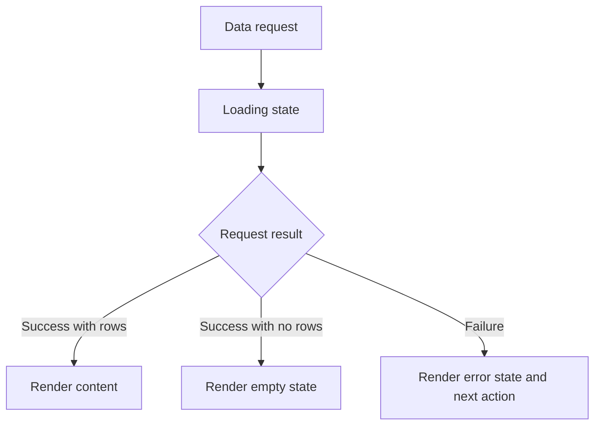

# Chapter 16 - Validation, errors, and empty states

Features are not finished when the happy path works. Real users arrive with slow connections, empty databases, invalid emails, missing slugs, broken uploads, and accidental double clicks. This chapter turns those cases into designed behavior.

## Where we're headed

By the end, forms validate input, errors are understandable, loading states are visible, empty states are helpful, and edge cases have been tested.

## The failure trap

Bad:

```txt
console.error(error)
return null
```

Problem: the developer sees something in the console, but the user sees a broken or blank screen.

Better:

```txt
show a human message
preserve useful user input
offer next action
log enough for debugging
```

## New ideas before you build

### Validation

**Real-life analogy:** an office form is checked before it is accepted. Missing names, bad emails, and oversized messages are sent back for correction.

**General idea:** validate user input before saving or sending it. Browser validation helps, but important rules also belong on the server.

```ts
if (!email.includes("@")) {
  return { error: "Enter a valid email address." };
}
```

Study more: [Frontend Interview Questions - Forms and Validation](https://resources.devweekends.com/resources/frontend-interview-qs)

**Comparison:** validation vs error handling: validation tries to stop bad input before work happens. Error handling responds when something still fails.

### Loading, empty, and error states

**Real-life analogy:** a shop should show "opening soon," "sold out," or "system unavailable" instead of leaving people staring at a blank window.

**General idea:** every data screen needs clear states for waiting, no results, failure, and success.

```tsx
if (isLoading) return <p>Loading...</p>;
if (error) return <p>Something went wrong. Try again.</p>;
if (projects.length === 0) return <p>No projects match this filter.</p>;
```

Study more: [Frontend Interview Questions - React Fundamentals](https://resources.devweekends.com/resources/frontend-interview-qs)

**Quick quiz:** what is worse for a visitor: a clear error message or a blank screen? Why does the blank screen feel less trustworthy?

Diagram:



## Build it

Audit every major surface:

```txt
projects list
project detail
articles list
article detail
contact form
newsletter form
admin login
CRUD forms
image upload
contact inbox
dashboard cards
```

For each, test loading, empty, error, success, and blocked cases.

**Bug hunt:** intentionally test slow network, invalid email, empty database, missing slug, failed upload, and double submit. Write the expected UI response before checking the actual response.

**UI exercise:** create a checklist for every page with these states: loading, empty, error, success, unauthorized, and not found. Fill it out before polishing visuals.

## Automated testing

Manual testing teaches you what should happen. Automated testing helps you prove it still happens after the next change.

Start with three levels:

```txt
unit tests
  small functions: validation, mappers, formatters

integration tests
  feature behavior: project API module, auth guards, form submit flow

end-to-end smoke tests
  critical paths: public read, admin login, contact submit
```

Good first tests for this portfolio:

```txt
validateProjectInput rejects empty title and bad URLs
mapProjectRow converts snake_case database rows to camelCase UI data
getPublishedProjects never returns draft projects
contact form shows stored-but-email-failed message clearly
RequireAuth redirects signed-out users
```

Example unit test shape:

```ts
it("rejects a project without a title", () => {
  const errors = validateProjectInput({
    title: "",
    slug: "portfolio",
    summary: "A useful summary that explains the project outcome.",
    demoUrl: "https://example.com",
  });

  expect(errors.title).toBe("Title is required.");
});
```

Do not try to test everything at once. Protect the risky parts first: validation, RLS assumptions, contact failure behavior, and anything that could leak private content.

**Big word alert:** **regression** means something that used to work breaks after a change. A regression test checks that old behavior still works.

**Testing exercise:** write one unit test for a validation helper and one smoke-test checklist for the contact form. The goal is not coverage percentage; the goal is protecting behavior that matters.

**Regression exercise:** after fixing one error state, retest one unrelated happy path. This builds the habit of checking that a fix did not break normal use.

## Empty state examples

Bad:

```txt
No data.
```

Better:

```txt
No projects match this category yet. Clear filters to see all projects.
```

Bad:

```txt
Error.
```

Better:

```txt
Message saved, but the email notification failed. Check the admin inbox.
```

## Daily guideline

Read the "Think About Real Users" and "Test Edge Cases" sections in `Daily_Software_Development_Guidelines.md` if that file is part of your cohort resources. Use them right here: decide what the visitor or owner needs to know at the moment of failure.

## Definition of Done

- [ ] Required forms validate before submission and on the server where needed.
- [ ] Loading states exist.
- [ ] Empty states explain what happened.
- [ ] Error states offer a next step.
- [ ] Success states confirm what changed.
- [ ] Edge cases were tested and logged.
- [ ] Validation helpers or mappers have at least one unit test.
- [ ] One critical user flow has an integration or smoke test plan.

> **Log it.** In `learning-log/16-validation-errors-empty-states.md`, list three edge cases you tested and how the UI responded.

**Motivation pause:** from `Software_Engineering_Community_Affirmations.md`: "Progress matters more than perfection." Failure states are easy to avoid because they are messy; designing them is a real sign of growth.

Next: the app behaves correctly. Now make it feel good on real devices and assistive technology. -> **[Chapter 17 - Responsive polish and accessibility](17-responsive-polish-accessibility.md)**
