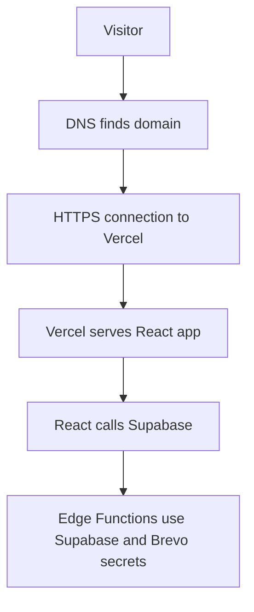

# Chapter 18 - Deploy with Vercel and Supabase

Local success is not shipping. Deployment is where environment variables, migrations, storage policies, Edge Functions, and frontend builds meet reality.

## Where we're headed

By the end, the frontend is deployed to Vercel, Supabase backend pieces are deployed, secrets are set in the right places, and the production app works end to end.

## The deployment trap

Bad:

```txt
works locally
push to Vercel
hope Supabase functions and secrets are fine
```

Problem: frontend deployment does not automatically prove database policies, Edge Functions, Storage, Cron, or Brevo secrets are correct.

Better:

```txt
run production build
deploy Supabase migrations/functions
set Supabase secrets
set Vercel public env vars
test every workflow on production
```

## New ideas before you build

### Production build

**Real-life analogy:** a rehearsal catches problems before opening night. A production build catches errors before users see them.

**General idea:** run a production build locally before deploying. Development mode can hide problems that the production build reveals.

```txt
npm run build
```

Study more: [Frontend Interview Questions - Deployment and Best Practices](https://resources.devweekends.com/resources/frontend-interview-qs)

## Environment boundary

Vercel should receive:

```txt
VITE_SUPABASE_URL
VITE_SUPABASE_ANON_KEY
```

Supabase Edge Function secrets should receive:

```txt
BREVO_API_KEY
BREVO_SENDER_EMAIL
CONTACT_RECIPIENT_EMAIL
SUPABASE_SERVICE_ROLE_KEY if required server-side
```

Never put Brevo or service-role secrets in Vercel frontend variables.

### Deployment boundaries

**Real-life analogy:** a public reception desk and a locked office cabinet hold different information. Vercel gets browser-safe values; Supabase stores server secrets.

**General idea:** frontend env vars go to Vercel. Edge Function secrets go to Supabase.

```txt
Vercel: VITE_SUPABASE_URL, VITE_SUPABASE_ANON_KEY
Supabase: BREVO_API_KEY, SUPABASE_SERVICE_ROLE_KEY
```

Study more: [AWS Core Concepts - Shared Responsibility Model](https://resources.devweekends.com/aws/core-concepts)

## Daily guideline

From `Daily_Software_Development_Guidelines.md`: **monitor production**. Deployment is not done when Vercel turns green. After shipping, open the production app, test the real workflows, check function logs, confirm emails, and watch for failed requests.

## Build it

Run a production build locally first. Fix build errors before deployment.

Before deploying, add a basic CI check. If using GitHub, a small GitHub Actions workflow should run on pull requests or pushes:

```txt
checkout repo
install dependencies
run lint if configured
run tests
run production build
```

Example workflow shape:

```yaml
name: CI

on:
  pull_request:
  push:
    branches: [main]

jobs:
  checks:
    runs-on: ubuntu-latest
    steps:
      - uses: actions/checkout@v4
      - uses: actions/setup-node@v4
        with:
          node-version: 20
          cache: npm
      - run: npm ci
      - run: npm test -- --run
      - run: npm run build
```

If you deploy with Vercel, treat preview deployments as review environments. Open the preview URL, test the public pages, and confirm it is using the correct Supabase project and browser-safe environment variables.

Deploy Supabase migrations, storage buckets/policies, and Edge Functions. Set secrets. Then deploy the Vite app to Vercel.

Test production:

```txt
public pages
project/article reads
admin login
project CRUD
article CRUD
image upload
contact form
Brevo notification
contact inbox
newsletter signup
visit tracking
RLS blocked cases
```

## Definition of Done

- [ ] Vercel deployment succeeds.
- [ ] Supabase migrations are applied.
- [ ] Edge Functions are deployed.
- [ ] Supabase secrets are set.
- [ ] Vercel env vars contain only browser-safe values.
- [ ] CI or Vercel checks run tests/build before production deploy.
- [ ] Preview deployment was manually smoke-tested before production.
- [ ] Contact form stores messages and triggers Brevo.
- [ ] Admin workflows work in production.
- [ ] RLS blocked cases still block in production.

> **Log it.** In `learning-log/18-deploy-vercel-supabase.md`, explain which secrets live in Vercel and which live in Supabase, and why.

## Learning bridge

Use this as a flexible pause point before, during, or after the chapter work. Pick **one or two**, not all of them. Skip the rest without guilt if your Definition of Done is complete.

**Blog links:** read [Cloudflare - What is DNS?](https://www.cloudflare.com/en-in/learning/ddos/glossary/domain-name-system-dns/), [http.dev - HTTPS explained](https://http.dev/https), and [Cloudflare - DNS over TLS vs DNS over HTTPS](https://www.cloudflare.com/en-in/learning/dns/dns-over-tls/). Deployment is easier to understand when DNS, HTTPS, and TLS are not magic words.

**Production smoke test:** after deployment, test public pages, admin login, project CRUD, image upload, contact submit, Brevo email, RLS blocked reads, and newsletter signup.

**Deployment exercise:** make a production checklist with three columns: Vercel, Supabase, and Brevo. Put each environment variable, migration, function, and manual test under the correct owner.

**CI/CD exercise:** add one automated check before deployment: test, lint, or build. Then intentionally break the build locally and confirm the check would catch it.

**Comparison:** DNS vs HTTPS: DNS helps the browser find the server for a domain. HTTPS protects the connection between the browser and server.

**Big word alert:** **TLS** means Transport Layer Security. It is the security layer behind HTTPS that helps encrypt traffic and verify the server.

**Diagram:**



**Motivation pause:** from `Software_Engineering_Community_Affirmations.md`: "Keep shipping, keep improving." Deployment is not a finish line where everything must be flawless; it is the moment your improvement loop becomes real.

Next: the app is deployed. Now prove you understand it and plan how to keep it alive. -> **[Chapter 19 - Final review and maintenance](19-final-review-maintenance.md)**
