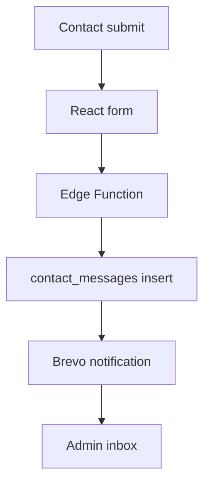
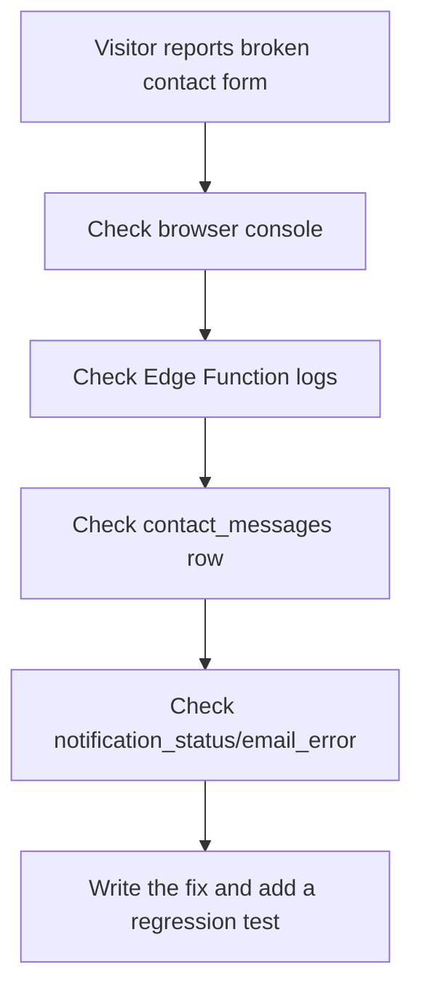

# Chapter 19 - Final review and maintenance

Shipping is not the end of the course. The final test is whether you can explain the system you built: the data model, security rules, frontend routes, admin flows, email path, deployment boundary, and tradeoffs.

## Where we're headed

By the end, the portfolio has a final README, a maintenance rhythm, a demo script, and a self-review that proves understanding.

## The final-review trap

Bad:

```txt
Here is my link.
```

Problem: a link shows the result, not the thinking.

Better:

```txt
Here is my link.
Here is the architecture.
Here is what is public/private.
Here is how contact works.
Here is what I would improve next.
```

## New ideas before you build

### System walkthrough

**Real-life analogy:** a mechanic can trace how fuel, electricity, and controls move through a car. A developer should trace how data moves through an app.

**General idea:** explain what happens when a visitor opens a page, submits a contact form, or when the owner publishes a project.



Study more: [Frontend Interview Questions - Interview Tips](https://resources.devweekends.com/resources/frontend-interview-qs)

### Maintenance rhythm

**Real-life analogy:** a garden needs watering after it is planted. A portfolio needs updates after it is shipped.

**General idea:** keep adding real project writeups, checking production workflows, reviewing secrets, and updating dependencies.

```txt
Monthly: test contact flow, update content, check broken links
Quarterly: review dependencies, secrets, RLS policies, analytics
```

Study more: [Git Crash Course](https://resources.devweekends.com/courses/devops-tools/git-overview)

### Error monitoring

**Real-life analogy:** a smoke alarm does not fix a fire, but it tells you something needs attention before the whole building is damaged.

**General idea:** production systems need places to look when something fails. For this project, start with Vercel deployment/function logs, Supabase API and Edge Function logs, browser console errors, and failed contact/newsletter records in the database.



## Daily guideline

From `Daily_Software_Development_Guidelines.md`: **document important decisions** and **review before merging**. Your README should explain not only what you built, but why: why RLS, why Edge Functions, why store messages before email, why secrets split between Vercel and Supabase.

## Build it

Write the project README. Include:

```txt
product summary
tech stack
features
architecture overview
database tables
security/RLS summary
environment variable guide
deployment notes
known tradeoffs
future improvements
```

Prepare a demo path:

```txt
public homepage
projects
articles
contact submission
admin login
message inbox
project/article edit
image upload
deployment/secrets explanation
```

Create a maintenance rhythm. Monthly: check messages, update articles/projects, review broken links. Quarterly: review dependencies, secrets, RLS policies, and analytics.

Add a monitoring routine:

```txt
weekly
  review Supabase Edge Function errors
  review Vercel deployment/runtime errors
  check failed contact notifications
  check newsletter_runs failures

after every incident
  write what happened
  write user impact
  fix the cause
  add a test or checklist item
```

## Human rhythm

When stuck, think on paper. Write what you expected, what happened, what changed recently, and what you tried. Rubber duck debugging means explaining the problem out loud to something or someone that does not solve it for you. The explanation often reveals the missing assumption.

Remember why you started: this portfolio is not only a site. It is evidence of your judgment.

## Definition of Done

- [ ] README explains the full-stack system.
- [ ] Demo script exists.
- [ ] Maintenance rhythm exists.
- [ ] Monitoring routine names where errors are checked.
- [ ] Failed contact/newsletter states are reviewable by the owner.
- [ ] Learner can explain Supabase Auth, RLS, Storage, Edge Functions, Brevo, and Vercel env vars.
- [ ] Learning log is complete.
- [ ] Final production smoke test passes.

> **Log it.** In `learning-log/19-final-review-maintenance.md`, write your final architecture explanation as if answering an interview question.

## Learning bridge

Use this as a flexible pause point before, during, or after the chapter work. Pick **one or two**, not all of them. Skip the rest without guilt if your Definition of Done is complete.

**Blog links:** read [Cloudflare - How Cloudflare DNS works](https://developers.cloudflare.com/fundamentals/concepts/how-cloudflare-works/), [MDN - HTTP](https://developer.mozilla.org/en-US/docs/HTTP), and [IBM - Database normalization](https://www.ibm.com/think/topics/database-normalization). Your final README should be able to explain how browser, DNS, HTTPS, frontend, backend, database, and deployment fit together.

**Blog assignment:** write the final case study using this outline: problem, users, architecture, hardest tradeoff, security model, failure handling, deployment, what you would improve next.

**Self-review quiz:** pick one feature and trace it from UI to database to deployment. If you cannot explain one step, revisit that chapter.

**Git exercise:** review your commit history and find one commit message that could be clearer. Write the improved message in your learning log and explain why it is better.

**Maintenance exercise:** create a monthly maintenance issue template with checkboxes for dependency review, broken links, contact flow, RLS spot checks, and production smoke test.

**Monitoring exercise:** find where Supabase Edge Function logs and Vercel deployment logs live for your project. Add those links or instructions to the README.

**Comparison:** README vs learning log: the README explains the finished project to others. The learning log records how your understanding developed while building it.

**Big word alert:** **architecture** means the high-level structure of the system: parts, responsibilities, and how data moves between them.

Next: close the course by turning the shipped project into a professional habit. -> **[Chapter 20 - Closing](20-closing.md)**
